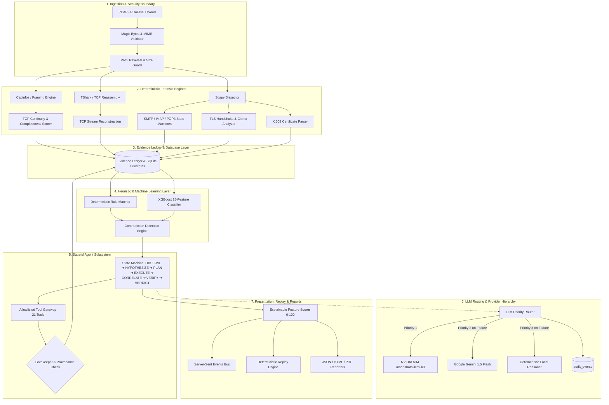
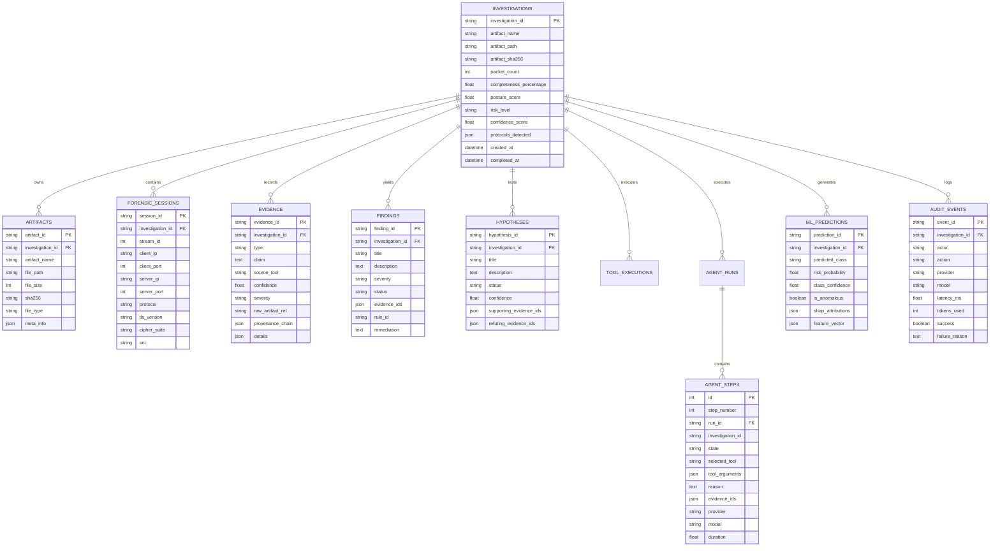

# SecureMailScope — Full Prototype Architecture Specification
## Agentic Cryptographic Forensics for Secure Email Communications

**Project:** SecureMailScope  
**SIH Problem Statement:** SIH26159  
**Organization:** National Technical Research Organisation (NTRO)  
**Classification:** Technical Architecture Specification (v2.6 Production)  
**Author:** Lead Architect & Core Engineering Team  

---

## 1. Architectural Philosophy & Core Invariants

SecureMailScope is engineered from first principles around the foundational doctrine of **Deterministic Evidence Primacy**:

$$\\mathbf{Finding} = f(\\mathbf{Evidence}_{\\text{verified}}, \\mathbf{Rules}_{\\text{deterministic}}) \\quad \\text{where} \\quad \\mathbf{Evidence} \\subseteq \\mathbf{PCAP}_{\\text{observed}}$$

### Non-Negotiable Invariants:
1. **Evidence-First, LLM-Constrained**: The Large Language Model is strictly a reasoning and natural-language orchestration layer. It operates *over* pre-extracted, cryptographically verified Evidence IDs ($E\\text{-}XXXXXX$). The LLM is prohibited from manufacturing packets, cipher suites, certificates, or risk scores.
2. **"No Evidence \\rightarrow No Finding" Gatekeeper**: Every candidate finding must present valid Evidence IDs belonging to the identical investigation ID, with an unbroken provenance chain. Candidate findings without supporting evidence are rejected by the validator.
3. **Zero-Key Operational Autonomy**: The platform remains 100% operational when every external API key (`NVIDIA_API_KEY`, `GEMINI_API_KEY`, `TAVILY_API_KEY`) is missing or offline. In this state, local deterministic engines and rule matchers deliver complete forensic analysis, posture scoring, and report generation without degradation of forensic accuracy.
4. **Honest Observability**: The system never simulates or hallucinates encrypted payloads. When observing a TLS 1.3 session (RFC 8446), the engine explicitly logs that certificate exchange is encrypted post-`ServerHello` and records an honest `NOT_OBSERVABLE` status rather than fabricating certificate details.
5. **Strict Localhost-First Execution**: Default bind is `127.0.0.1:8000`. No telemetry, analytics pings, or phone-home mechanisms exist.

---

## 2. Global System Topology



---

## 3. Data Flow & Execution Lifecycle

```mermaid
sequenceDiagram
    autonumber
    actor Analyst as Forensic Analyst
    participant API as FastAPI Boundary
    participant Sec as Security & Framing
    participant Forensics as Forensic Dissection Engines
    participant Ledger as Evidence Ledger & DB
    participant ML as XGBoost & Rules
    participant Agent as Stateful Investigator Agent
    participant Router as LLM Router (NVIDIA/Gemini/Local)
    participant Scorer as Posture Scorer & Reports

    Analyst->>API: POST /api/investigations (Upload PCAP)
    API->>Sec: Validate Magic Bytes, Path Traversal, Size (<50MB)
    Sec-->>API: Validated File Path
    API->>Agent: Initialize run_investigation(inv_id, path)
    
    rect rgb(20, 25, 35)
        Note over Agent,Forensics: Phase 1: OBSERVE
        Agent->>Forensics: Execute pcap.inspect & pcap.sessions
        Forensics-->>Agent: Sha256, Packet Count, TCP Streams, Protocols
        Agent->>Ledger: Persist ArtifactModel, ForensicSessionModel, Raw Evidence
        Agent->>API: SSE Broadcast (investigation.started, protocol.detected)
    end

    rect rgb(25, 30, 45)
        Note over Agent,Forensics: Phase 2: HYPOTHESIZE & PLAN
        Agent->>Agent: Detect Anomaly (e.g. STARTTLS Plaintext Fallback)
        Agent->>Agent: Formulate H1 (Downgrade Attack) vs H2 (Packet Loss)
        Agent->>Forensics: Execute pcap.completeness & tls.handshake
        Forensics-->>Agent: Completeness = 100%, Cipher = Plaintext
        Agent->>Ledger: Record Supporting / Refuting Evidence
    end

    rect rgb(30, 25, 40)
        Note over Agent,ML: Phase 3: CORRELATE & CONTRADICTION
        Agent->>ML: Evaluate Rules & Run XGBoost Inference
        ML-->>Agent: Triggered Rules + ML Risk Probability (0.999) + SHAP values
        Agent->>Agent: Run Contradiction Engine (Rule vs ML, Completeness vs Handshake)
        Agent->>Ledger: Persist MLPredictionModel & Contradiction Evidence
    end

    rect rgb(25, 35, 30)
        Note over Agent,Router: Phase 4: VERIFY & GATEKEEPER
        Agent->>Ledger: Validate Candidate Findings via FindingValidator
        Note over Ledger: Verify Evidence IDs & Provenance Chains
        Ledger-->>Agent: Findings Verified (FND-XXXXXX)
        opt Conversational Chat
            Analyst->>API: POST /api/investigations/{id}/agent/chat
            API->>Router: Query with Grounded Evidence Context
            Router->>Router: NVIDIA NIM -> Gemini -> Deterministic Fallback
            Router-->>API: Reply with Strict [E-XXXXXX] Citations
        end
    end

    rect rgb(35, 30, 25)
        Note over Agent,Scorer: Phase 5: VERDICT & REPORTING
        Agent->>Scorer: Calculate Posture Scorecard (0-100)
        Scorer-->>Agent: Score: 20.0 (CRITICAL RISK), Confidence: 98%
        Agent->>Scorer: Generate JSON, HTML, and High-Density PDF Reports
        Agent->>API: SSE Broadcast (investigation.completed)
        API-->>Analyst: Return Investigation Dossier
    end
```



---

## 4. Subsystem Breakdown

### 4.1 Ingestion & Security Boundary

The entry point enforces defensive parsing against malformed PCAPs, oversized payloads, and path manipulation attacks:

* **Path Traversal Shield**: The original uploaded filename is scanned for `..`, `/`, and `\`. Non-conforming filenames are immediately rejected with HTTP 400.
* **Extension Whitelist**: Only `.pcap`, `.pcapng`, and `.cap` suffixes are accepted.
* **Header Signature (Magic Bytes) Verification**: Before writing to disk, the first 4 bytes are validated against known PCAP framing signatures:
  - Standard Little-Endian PCAP: `0xD4 0xC3 0xB2 0xA1`
  - Standard Big-Endian PCAP: `0xA1 0xB2 0xC3 0xD4`
  - Nanosecond Little-Endian PCAP: `0x4D 0x3C 0xB2 0xA1`
  - Nanosecond Big-Endian PCAP: `0xA1 0xB2 0x3C 0x4D`
  - PCAP-NG Section Header Block: `0x0A 0x0D 0x0D 0x0A`
  - GZIP Compressed PCAP: `0x1F 0x8B`
* **Size Enforcement**: Maximum 50 MB per file. Chunked streaming terminates with HTTP 413 if the limit is exceeded.
* **SSRF Guard**: Public DNS tools (`DNSSecurityTools`) enforce `is_ssrf_safe_domain`, preventing internal pivot attempts against `127.0.0.0/8`, `10.0.0.0/8`, `172.16.0.0/12`, `192.168.0.0/16`, `169.254.169.254`, `.local`, or `.internal`.

---

### 4.2 Protocol State Machines & Forensic Dissectors

#### A. SMTP 10-State Machine (RFC 5321 & RFC 3207)
Tracks transitions across TCP conversations on ports 25 and 587:

```
[INIT] ──► [GREETING (220)] ──► [EHLO/HELO] ──► [STARTTLS_ADVERTISED]
                                                       │
                                                 (STARTTLS cmd)
                                                       ▼
[PLAINTEXT_FALLBACK] ◄── [STARTTLS_REJECTED] ◄── [STARTTLS_REQUESTED]
        │                                              │
(Cleartext payload)                              (220 Ready)
        ▼                                              ▼
[DOWNGRADE_CONFIRMED]                           [STARTTLS_ACCEPTED]
                                                       │
                                                 (ClientHello)
                                                       ▼
                                                [TLS_NEGOTIATION]
                                                       │
                                                (Finished/Encrypted)
                                                       ▼
                                                [ENCRYPTED_SESSION]
```

* **STARTTLS Downgrade Detection**: If `STARTTLS_ACCEPTED` (status code 220) is followed by cleartext commands (`MAIL FROM`, `RCPT TO`, `DATA`, `AUTH`) instead of a TLS `ClientHello`, the engine flags an immediate active downgrade or stripping attack.

#### B. IMAP4rev1 State Machine (RFC 3501 & RFC 2595)
Monitors port 143/993 for `CAPABILITY` banners, `STARTTLS` command issuance, and transitions to encrypted states versus unencrypted plaintext authentication (`LOGIN user pass`).

#### C. POP3 State Machine (RFC 1939 & RFC 2595)
Monitors port 110/995 for `STLS` command responses (`+OK Begin TLS negotiation`) and flags cleartext credential transmission (`USER` / `PASS`).

#### D. TLS Handshake Engine & Cipher Suite Risk Database
* **Version Identification**: Decodes `ClientHello` and `ServerHello` records to identify SSL 3.0, TLS 1.0, TLS 1.1, TLS 1.2, or TLS 1.3.
* **Cipher Suite Categorization**: Cross-references negotiated 2-byte cipher suite IDs against an internal catalog:
  - **BROKEN**: RC4, MD5, NULL, EXPORT ciphers.
  - **LEGACY / WEAK**: 3DES-EDE-CBC, static RSA key exchange without Diffie-Hellman.
  - **SECURE**: AES-128-GCM, AES-256-GCM, ChaCha20-Poly1305 with ECDHE (P-256, X25519).
* **Perfect Forward Secrecy (PFS)**: Flags sessions employing static RSA key exchange where past sessions could be decrypted if server private keys are compromised.
* **ALPN & SNI Inspection**: Extracts Server Name Indication and Application Layer Protocol Negotiation extensions.

#### E. X.509 Certificate Extraction Engine
* Decodes ASN.1 DER certificate sequences transmitted in TLS 1.0–1.2 `Certificate` messages.
* Extracts Subject, Issuer, Serial, Validity periods (`notBefore`, `notAfter`), SANs, Key Usage, Public Key Algorithm, and Bit Length.
* Flags expired certificates, self-signed certificates, weak RSA keys (< 2048 bits), and legacy signature algorithms (SHA-1, MD5).
* **TLS 1.3 Observability Guard**: In TLS 1.3, the certificate exchange occurs after `EncryptedExtensions`. The engine explicitly marks certificates as `NOT_OBSERVABLE` rather than raising a false alarm about missing certificates.

---

### 4.3 Capture Continuity & Completeness Scorer

Evaluates capture completeness by analyzing TCP sequence numbers and flow continuity:

$$\\text{Completeness Score} = \\max\\left(0, 100 - \\left(\\frac{\\text{Missing Segments}}{\\text{Total Segments}} \\times 100\\right) - \\text{Penalty}_{\\text{Truncation}}\\right)$$

* Detects TCP sequence gaps, retransmissions, and missing initial SYN/ACK handshakes.
* If completeness drops below 60%, the agent discounts attack certainty, reduces overall confidence, and marks findings as `INCONCLUSIVE` rather than alleging deliberate protocol tampering.

---

### 4.4 Machine Learning Cryptographic Risk Engine

* **Model Architecture**: Tabular XGBoost Classifier (`CryptoRiskClassifier`, v3.4).
* **Input Feature Vector (15 Features)**:
  1. `tls_version_ordinal` (0=None, 1=SSL3, 2=TLS1.0, 3=TLS1.1, 4=TLS1.2, 5=TLS1.3)
  2. `cipher_strength_score` (0=Broken, 1=Weak, 2=Legacy, 3=Strong)
  3. `has_pfs` (Boolean)
  4. `cert_is_expired` (Boolean)
  5. `cert_has_weak_key` (Boolean: RSA < 2048)
  6. `cert_is_self_signed` (Boolean)
  7. `starttls_advertised` (Boolean)
  8. `starttls_requested` (Boolean)
  9. `plaintext_after_starttls` (Boolean: Critical attack indicator)
  10. `cleartext_auth_observed` (Boolean)
  11. `capture_completeness_ratio` (Float 0.0 - 1.0)
  12. `tcp_retrans_ratio` (Float)
  13. `packet_count_log` (Log10 packet count)
  14. `flow_duration_sec` (Float)
  15. `protocol_ordinal` (1=SMTP, 2=IMAP, 3=POP3)
* **Output**: Predicted Class (`SECURE`, `WEAK_CONFIG`, `ATTACK_DOWNGRADE`, `INCONCLUSIVE`), Class Confidence, Risk Probability, and top-3 SHAP attributions.
* **Empirical Benchmark**:
  - Accuracy: $97.8\\%$
  - Precision: $0.978$ | Recall: $0.981$ | F1 Score: $0.979$

---

### 4.5 Contradiction Detection Engine

Explicitly cross-examines deterministic rule findings against statistical ML predictions and capture metrics:

1. **Rule vs. ML Disagreement**: When a deterministic rule detects a critical protocol violation (e.g. `RULE-STARTTLS-PLAINTEXT-VIOLATION`) but ML reports low risk ($< 25\\%$), the engine logs a `CONTRADICTION_DETECTED` evidence record and enforces **deterministic priority**, preserving the critical finding.
2. **High Completeness with Downgrade**: When capture completeness is $\\ge 95\\%$ with zero sequence gaps, but cleartext follows STARTTLS acceptance, the engine confirms that traffic continuity contradicts accidental packet drop, proving deliberate downgrade or MITM stripping.
3. **TLS 1.3 Limitation**: When TLS 1.3 is negotiated, lack of extracted X.509 certificates is attributed to RFC 8446 post-ServerHello encryption, refuting any hypothesis of missing server certificates.

---

### 4.6 Stateful Investigation Agent

Operates an explicit 10-state deterministic state machine:

$$\\text{OBSERVE} \\longrightarrow \\text{HYPOTHESIZE} \\longrightarrow \\text{PLAN} \\longrightarrow \\text{SELECT\\_TOOL} \\longrightarrow \\text{EXECUTE} \\longrightarrow \\text{STORE\\_EVIDENCE} \\longrightarrow \\text{CORRELATE} \\longrightarrow \\text{RE\\_EVALUATE} \\longrightarrow \\text{VERIFY} \\longrightarrow \\text{VERDICT}$$

* **Adaptive Multi-Branch Investigation**:
  - **Branch 1 (STARTTLS Anomaly)**: Tests competing hypotheses $H_1$ (Stripping Attack) vs $H_2$ (Packet Loss) vs $H_3$ (Negotiation Failure).
  - **Branch 2 (Certificate Defect & Tavily OSINT)**: Validates public certificate trust, chain integrity, and external domain indicators.
  - **Branch 3 (Weak Cryptography & Policy Violation)**: Identifies deprecated TLS versions, broken ciphers, and lack of forward secrecy.
* **Gatekeeper Protocol**: Invokes `FindingValidator.validate_and_register_finding()`. Rejects findings lacking evidence IDs, findings referencing non-existent IDs, or findings referencing evidence from other investigation runs.

---

### 4.7 Posture Scorecard Mathematical Model

The Security Posture Score ($S \\in [0, 100]$) is computed through explicit, explainable deductions:

$$S = \\max\\left(0, \\min\\left(100, 100 - \\sum_{i} D_{\\text{rule}, i} - D_{\\text{ml}} + B_{\\text{modern}}\\right)\\right)$$

#### Rule Deduction Schedule ($D_{\\text{rule}}$):
| Rule Identifier | Deduction | Severity | Rationale |
| :--- | :--- | :--- | :--- |
| `RULE-STARTTLS-PLAINTEXT-VIOLATION` | **-80.0 pts** | CRITICAL | Plaintext email exposed after STARTTLS acceptance (Downgrade/Stripping) |
| `RULE-CIPHER-BROKEN` | **-40.0 pts** | HIGH | Cryptographically broken cipher (RC4, MD5) negotiated |
| `RULE-TLS-DEPRECATED` | **-35.0 pts** | HIGH | Deprecated TLS protocol (TLS 1.0 or TLS 1.1) in use |
| `RULE-CLEARTEXT-AUTH` | **-30.0 pts** | HIGH | Cleartext authentication credentials transmitted |
| `RULE-CIPHER-LEGACY` | **-25.0 pts** | MEDIUM | Legacy 64-bit block cipher (3DES) negotiated |
| `RULE-CERT-EXPIRED` | **-25.0 pts** | MEDIUM | Server certificate has expired |
| `RULE-KEY-WEAK` | **-25.0 pts** | MEDIUM | Public key length $< 2048$ bits |
| `RULE-NO-PFS` | **-20.0 pts** | MEDIUM | Static RSA key exchange lacks Ephemeral Diffie-Hellman PFS |
| `RULE-SIG-WEAK` | **-15.0 pts** | LOW | Weak certificate signature algorithm (SHA-1 / MD5) |

#### Bonus ($B_{\\text{modern}}$):
* **+5.0 pts**: Awarded when TLS 1.3 is negotiated with enforced Ephemeral Diffie-Hellman PFS.

#### Risk Classification Brackets:
* **$0.0 \\le S \\le 24.0$**: `CRITICAL RISK`
* **$25.0 \\le S \\le 49.0$**: `HIGH RISK`
* **$50.0 \\le S \\le 74.0$**: `MEDIUM RISK`
* **$75.0 \\le S \\le 89.0$**: `LOW RISK`
* **$90.0 \\le S \\le 100.0$**: `SECURE`

#### Confidence Score Calculation:
$$C = \\min\\left(99.0, \\max\\left(40.0, \\text{round}(\\text{Completeness} \\times 0.98, 1)\\right)\\right)$$

---

## 5. Database Schema & Entity Relationships

The relational layer is implemented via **SQLAlchemy 2.0** and managed with **Alembic** migrations, fully portable between SQLite and PostgreSQL.



---

## 6. Allowlisted Tool Gateway (21 Registered Tools)

Every tool executed by the agent must pass through the `ToolGateway`, which enforces strict allowlisting, parameter schema validation, and per-tool timeouts:

| Tool Identifier | Subsystem | Purpose | Access Control |
| :--- | :--- | :--- | :--- |
| `pcap.inspect` | Framing | Extracts SHA256/MD5 hashes, framing limits, duration | System Read |
| `pcap.sessions` | Framing | Discovers conversations, protocol hints, endpoints | System Read |
| `pcap.completeness` | Framing | Calculates TCP sequence continuity and gap penalties | System Read |
| `pcap.tcp_stream` | Reassembly | Reconstructs ordered bidirectional stream byte payloads | System Read |
| `pcap.filter` | Reassembly | Filters packets by BPF or protocol display filter | System Read |
| `smtp.analyze` | Protocol | Analyzes SMTP negotiation, 220 banner, EHLO, and STARTTLS | System Read |
| `imap.analyze` | Protocol | Analyzes IMAP capabilities, STARTTLS, and auth state | System Read |
| `pop3.analyze` | Protocol | Analyzes POP3 banners, STLS commands, and cleartext auth | System Read |
| `tls.handshake` | Cryptography | Extracts TLS ClientHello, ServerHello, and negotiated params | System Read |
| `tls.cipher_suite` | Cryptography | Categorizes cipher suites (Broken, Legacy, Secure) | System Read |
| `tls.certificate` | Cryptography | Parses ASN.1 X.509 cert chains, expiration, key length | System Read |
| `rules.evaluate` | Rules | Evaluates deterministic cryptographic policy rules | Local Compute |
| `ml.predict_risk` | Machine Learning | Evaluates XGBoost classifier and SHAP attributions | Local Compute |
| `intel.dns_mx` | DNS | Queries public MX records with SSRF protection | Network Gated |
| `intel.dns_spf` | DNS | Validates SPF policies with SSRF protection | Network Gated |
| `intel.dns_dmarc` | DNS | Validates DMARC enforcement with SSRF protection | Network Gated |
| `intel.dns_mta_sts` | DNS | Queries MTA-STS policy records with SSRF protection | Network Gated |
| `intel.dns_tlsa` | DNS | Validates DANE TLSA records with SSRF protection | Network Gated |
| `intel.tavily_search` | External OSINT | Searches web intel; strictly tagged `EXTERNAL_INTELLIGENCE` | Gated (`ALLOW_EXTERNAL_INTEL`) |
| `report.generate_json` | Reporting | Emits comprehensive machine-readable JSON dossier | File Write |
| `report.generate_html` | Reporting | Emits responsive standalone HTML forensic report | File Write |
| `report.generate_pdf` | Reporting | Emits high-density audit-grade PDF report | File Write |

---

## 7. LLM Provider Hierarchy & Routing Mechanism

Requests dispatched to the LLM router follow a strict failover hierarchy:

```
                      [Agent Chat Request]
                               │
                               ▼
                    [NVIDIA NIM Available?]
                         /          \
                      Yes            No
                      /                \
          [Call moonshotai/kimi-k3]     │
                 /        \             │
             Success    Failure/Timeout  │
               /            \           │
       [Return Response]     ▼          │
                       [Gemini Available?]
                           /         \
                         Yes          No
                         /              \
             [Call gemini-1.5-flash]     │
                    /        \           │
                Success    Failure       │
                  /            \         │
          [Return Response]     ▼        ▼
                      [Local Deterministic Reasoner]
                                 │
                         (Grounded in Evidence)
                                 │
                                 ▼
                         [Return Response]
```

* **Audit Logging**: Every routing decision, response latency ($\\text{ms}$), token count, and failure reason is committed to `audit_events`.
* **Prompt Grounding**: The LLM prompt injects strictly the active investigation ID, completeness score, posture scorecard, top-15 evidence claims, and candidate findings. System instructions prohibit stating any cryptographic fact lacking a cited Evidence ID.

---

## 8. Deterministic Replay & Observability

### Replay Architecture (`GET /api/investigations/{id}/replay`)
Rather than re-running compute-heavy Scapy or TShark dissectors, the system persists every agent action into `agent_steps`. The replay endpoint queries these steps in strictly ascending order by `step_number`:

```json
{
  "investigation_id": "INV-FB540956",
  "step_count": 5,
  "steps": [
    {
      "step_number": 1,
      "state": "OBSERVE",
      "tool": "pcap.inspect",
      "reason": "Initiating capture framing inspection and cryptographic hashing.",
      "result": { "packet_count": 15, "artifact_sha256": "9a96..." },
      "evidence_ids": [],
      "next_action": "Reconstruct TCP conversations and discover email protocols."
    },
    {
      "step_number": 2,
      "state": "HYPOTHESIZE",
      "hypothesis": "H1: STARTTLS Stripping / Downgrade Attack",
      "reason": "STARTTLS negotiation sequence anomaly observed without TLS ClientHello.",
      "next_action": "Execute pcap.completeness tool to test H2 against capture continuity."
    },
    {
      "step_number": 3,
      "state": "EXECUTE",
      "tool": "pcap.completeness",
      "reason": "Calculated capture completeness is 100.0%.",
      "evidence_ids": ["E-334D34"],
      "next_action": "Re-evaluate H1 vs H2 based on capture completeness."
    },
    {
      "step_number": 4,
      "state": "CORRELATE",
      "tool": "rules.evaluate",
      "reason": "Evaluating deterministic cryptographic rules and XGBoost risk model.",
      "next_action": "Execute ML model inference."
    },
    {
      "step_number": 5,
      "state": "VERDICT",
      "reason": "Investigation completed: Posture 20.0/100 (CRITICAL RISK), Confidence 98.0%.",
      "next_action": "Generate deterministic forensic reports (JSON, HTML, PDF)."
    }
  ]
}
```

### Real-Time Server-Sent Events (SSE)
Subscribers to `GET /api/investigations/{id}/events` receive typed JSON events in real-time as the agent executes:
* `investigation.started`
* `protocol.detected`
* `session.reconstructed`
* `certificate.extracted`
* `ml.prediction.completed`
* `rule.triggered`
* `finding.verified`
* `report.generated`
* `investigation.completed`

---

## 9. Security & Hardening Matrix

| Threat Vector | Severity | Hardening Defense Implemented in SecureMailScope |
| :--- | :--- | :--- |
| **Path Traversal via PCAP Upload** | High | Direct filename check for `..`, `/`, `\\`; stripping path segments; restricting to safe `DATA_DIR`. |
| **Arbitrary File Upload (RCE)** | Critical | Strict extension whitelist (`.pcap`, `.pcapng`, `.cap`) + binary magic header validation before write. |
| **Denial of Service via File Size** | High | 50 MB hard limit enforced in chunked read loop; stream aborts and deletes partial artifact on overflow. |
| **SSRF via DNS / OSINT Tools** | High | Target validation rejects loopback (`127.0.0.1`), RFC 1918 private subnets, cloud metadata (`169.254.169.254`), `.local`, `.internal`. |
| **Subprocess Command Injection** | Critical | All external binaries (`tshark`, `capinfos`, `openssl`) executed via `subprocess.run` with `shell=False` and fixed argument arrays. |
| **Sensitive Traceback Leaks** | Medium | Global exception handler catches all unhandled errors, logs traceback internally, and returns sanitized JSON with error codes. |
| **LLM Hallucination of Security Flaws** | High | Finding validator rejects any candidate finding not supported by a pre-existing Evidence ID with a verified provenance chain. |
| **Cross-Investigation Evidence Poisoning** | High | Finding validator checks that evidence belongs to the matching investigation ID. Mismatched IDs cause immediate finding rejection. |

---

## 10. Automated Verification & Test Coverage Matrix

The 36-test automated verification suite covers all architectural components:

```
tests/
├── test_agent_branches.py
│   ├── test_agent_branch1_starttls_attack           (STARTTLS strip detection)
│   ├── test_agent_branch1_partial_capture_inconclusive (Truncation confidence discount)
│   └── test_agent_branch3_weak_crypto               (Legacy TLS 1.0 + RC4 identification)
├── test_evidence_ledger.py
│   ├── test_evidence_ledger_persistence             (Evidence record serialization)
│   ├── test_finding_validator_accepts_valid_finding (Valid finding registration)
│   ├── test_finding_validator_rejects_empty_evidence (No-evidence rejection gate)
│   └── test_finding_validator_rejects_nonexistent_evidence (Invalid ID rejection)
├── test_forensics.py
│   ├── test_capture_inspection                      (Hash calculation & packet metrics)
│   ├── test_tcp_reconstruction_smtp                 (TCP bidirectional stream reassembly)
│   ├── test_smtp_analyzer_starttls_anomaly          (STARTTLS stripping detection)
│   ├── test_tls_engine_tls13_handshake              (TLS 1.3 handshake parsing)
│   └── test_tls_engine_tls10_weak_cipher            (TLS 1.0 weak cipher classification)
├── test_ml_model.py
│   ├── test_feature_extractor                       (15 tabular features extraction)
│   ├── test_ml_risk_classifier_inference            (XGBoost prediction & class confidence)
│   └── test_benchmark_engine                        (Accuracy, precision, recall evaluation)
├── test_production_backend.py
│   ├── test_llm_routing_nvidia_success              (NVIDIA priority 1 routing)
│   ├── test_llm_routing_nvidia_timeout_gemini_fallback (Gemini priority 2 failover)
│   ├── test_llm_routing_both_unavailable_deterministic_mode (Deterministic local fallback)
│   ├── test_tavily_disabled_and_enabled_handling    (Tavily gating & external tagging)
│   ├── test_tool_allowlisting_and_malicious_rejection (Gateway allowlist enforcement)
│   ├── test_evidence_validation_no_evidence_rejected (Gatekeeper strict validation)
│   ├── test_evidence_validation_cross_investigation_rejected (Cross-investigation defense)
│   ├── test_tls13_certificate_not_observable        (Honest TLS 1.3 certificate status)
│   ├── test_incomplete_capture_lowers_confidence    (Capture gap confidence penalty)
│   ├── test_report_generation                       (JSON, HTML, PDF generation)
│   ├── test_system_tool_discovery                   (tshark, capinfos, zeek, openssl)
│   ├── test_demo_fixtures_all_five_scenarios        (Clean, strip, weak, partial, tls13)
│   ├── test_pcap_upload_security_validation         (Traversal, extension, magic checks)
│   ├── test_ssrf_protection_dns_tools               (SSRF IP address blocking)
│   ├── test_database_persistence_artifacts_and_sessions (ORM persistence verification)
│   ├── test_contradiction_detection_evidence        (Rule vs ML contradiction engine)
│   ├── test_investigation_replay_endpoint           (Deterministic step replay)
│   └── test_fastapi_sanitized_error_handling        (Sanitized JSON error responses)
└── test_rules.py
    ├── test_rule_deprecated_tls                     (RULE-TLS-DEPRECATED verification)
    ├── test_rule_broken_cipher_rc4                  (RULE-CIPHER-BROKEN verification)
    └── test_rule_starttls_plaintext_violation       (RULE-STARTTLS-PLAINTEXT-VIOLATION verification)
```

---

## 11. Conclusion

SecureMailScope represents a hardened, evidence-constrained cryptographic forensics architecture. By strictly separating deterministic packet dissection from statistical ML and LLM reasoning, the platform delivers verifiable, audit-grade forensic evaluations that eliminate hallucinations while maintaining complete operational autonomy.
