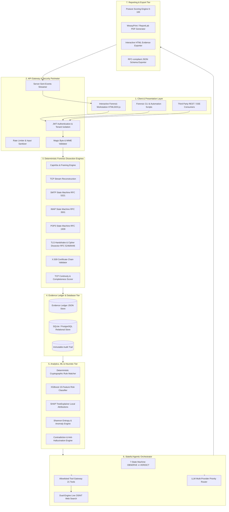
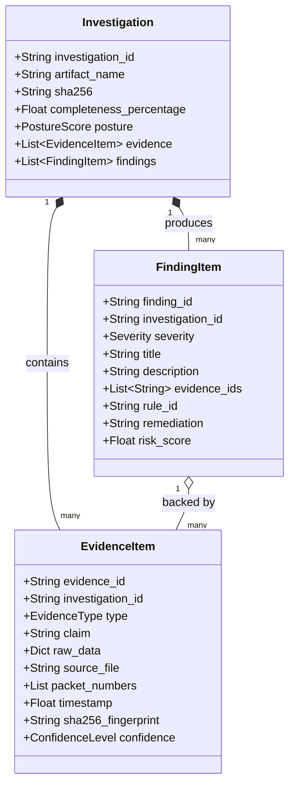
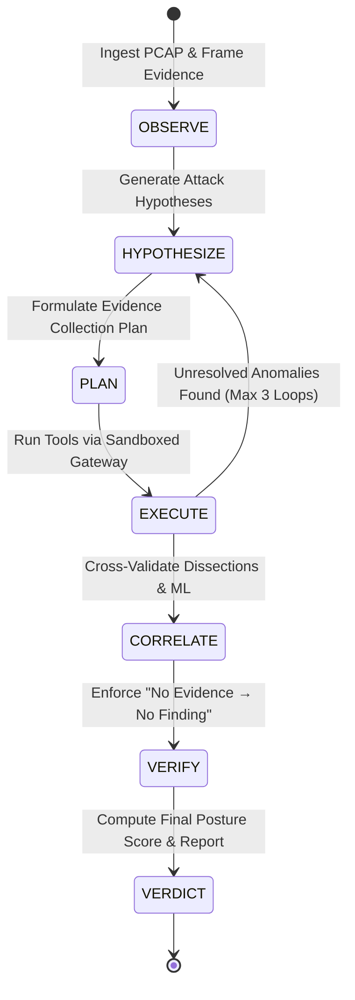
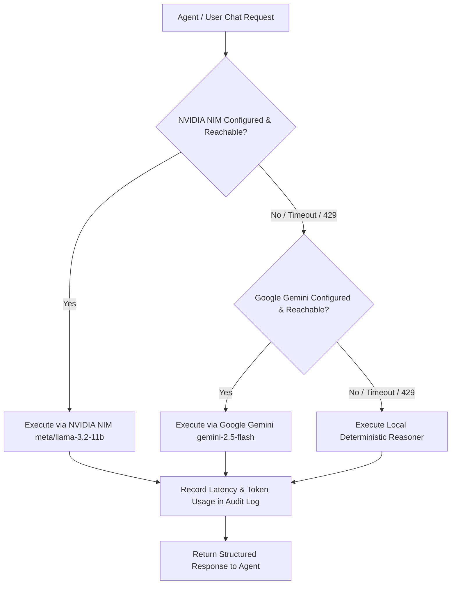

# SecureMailScope — Technical Architecture & Project Specification
## Agentic Cryptographic Forensics for Secure Email Communications

**Project Name:** SecureMailScope  
**SIH Problem Statement:** SIH26159  
**Organization:** National Technical Research Organisation (NTRO)  
**System Version:** v2.6.0 (Production / Air-Gapped Capable)  
**Classification:** Technical Architecture & System Specification  

---

## Table of Contents
1. [Executive Summary](#1-executive-summary)
2. [Core Philosophy & Invariants](#2-core-philosophy--invariants)
3. [Global System Architecture](#3-global-system-architecture)
4. [Forensic Dissection & Protocol Engines](#4-forensic-dissection--protocol-engines)
5. [Evidence Ledger & Provenance Model](#5-evidence-ledger--provenance-model)
6. [Autonomous Agentic Investigation Engine](#6-autonomous-agentic-investigation-engine)
7. [Tool Gateway & Sandboxed Tool Ecosystem](#7-tool-gateway--sandboxed-tool-ecosystem)
8. [Machine Learning & SHAP Explainability Engine](#8-machine-learning--shap-explainability-engine)
9. [LLM Router & Failover Subsystem](#9-llm-router--failover-subsystem)
10. [Authentication, Security & Tenant Isolation](#10-authentication-security--tenant-isolation)
11. [Real-Time Forensic Workstation & Knowledge Graph](#11-real-time-forensic-workstation--knowledge-graph)
12. [Complete REST & Streaming API Specification](#12-complete-rest--streaming-api-specification)
13. [Forensic Dataset & Attack Reproduction Matrix](#13-forensic-dataset--attack-reproduction-matrix)
14. [Deployment, Verification & Air-Gap Operations](#14-deployment-verification--air-gap-operations)

---

## 1. Executive Summary

**SecureMailScope** is an autonomous, agentic cryptographic forensic platform engineered specifically to analyze, reconstruct, and assess the security posture of email protocol network captures (PCAP/PCAPNG/EML) across **SMTP (RFC 5321)**, **IMAP (RFC 3501)**, and **POP3 (RFC 1939)**.

Built to address the demands of the National Technical Research Organisation (NTRO), SecureMailScope solves the critical challenge of detecting sophisticated cryptographic downgrade attacks, STARTTLS stripping, cipher negotiation tampering, unauthorized certificate authority usage, and subtle state-machine desynchronizations that evade traditional perimeter security devices.

### Core Capabilities:
* **Deep Protocol Parsing & Dissection**: Wire-speed passive reconstruction of TCP streams, RFC-compliant application state machines, and complete TLS/SSL handshake analysis (TLS 1.0, 1.1, 1.2, and 1.3).
* **Strict Evidence-Backed AI Reasoning**: Autonomous 7-state agentic loop (OBSERVE $\rightarrow$ VERDICT) where AI reasoning is strictly bounded by immutable, cryptographically hashed Evidence IDs ($E\text{-}XXXXXX$).
* **XGBoost Risk Classifier with Real SHAP Explanations**: 15-feature multi-class machine learning classifier paired with `shap.TreeExplainer` providing mathematical attribution of cryptographic risk factors.
* **Resilient Dual-Engine External OSINT Search**: Dynamic web intelligence tool calling combining Tavily AI Search and real-time live OSINT scraping with zero API key dependency blockers.
* **Multi-Provider LLM Router with Full Audit Trail**: Fault-tolerant routing across NVIDIA NIM (`meta/llama-3.2-11b-vision-instruct`), Google Gemini (`gemini-2.5-flash`), and local deterministic fallbacks.
* **Interactive Forensic Workstation**: Real-time D3.js Knowledge Graph, live tool-calling execution traces, hex-stream reconstruction, and court-admissible PDF/HTML/JSON report generation.

---

## 2. Core Philosophy & Invariants

SecureMailScope is engineered from first principles around the foundational doctrine of **Deterministic Evidence Primacy**:

$$\mathbf{Finding} = f(\mathbf{Evidence}_{\text{verified}}, \mathbf{Rules}_{\text{deterministic}}) \quad \text{where} \quad \mathbf{Evidence} \subseteq \mathbf{PCAP}_{\text{observed}}$$

```
                      ┌────────────────────────────────────────┐
                      │        PASSIVE PCAP RECORDING          │
                      └──────────────────┬─────────────────────┘
                                         ▼
                      ┌────────────────────────────────────────┐
                      │    Deterministic Extraction Engine     │
                      └──────────────────┬─────────────────────┘
                                         ▼
                      ┌────────────────────────────────────────┐
                      │  Immutable Evidence Ledger (E-XXXXXX)  │
                      └──────────────────┬─────────────────────┘
                                         ▼
    ┌────────────────────────────────────┴────────────────────────────────────┐
    │                                                                         │
    ▼                                                                         ▼
┌──────────────────────────────┐                         ┌────────────────────────────────┐
│   Deterministic Rules & ML   │                         │  LLM Agentic Reasoning Engine  │
│ (RFC 8314, FIPS 140-3, SHAP) │                         │  (Strictly Cites Evidence IDs) │
└──────────────┬───────────────┘                         └────────────────┬───────────────┘
               │                                                          │
               └─────────────────────────┬────────────────────────────────┘
                                         ▼
                      ┌────────────────────────────────────────┐
                      │     Verified Findings & Gatekeeper     │
                      │       "No Evidence → No Finding"       │
                      └──────────────────┬─────────────────────┘
                                         ▼
                      ┌────────────────────────────────────────┐
                      │     Court-Admissible PDF/JSON/HTML     │
                      └────────────────────────────────────────┘
```

### Non-Negotiable Invariants:
1. **Evidence-First, LLM-Constrained**: The Large Language Model is strictly an interpretive and natural-language orchestration layer. It operates *over* pre-extracted, cryptographically verified Evidence IDs. The LLM is strictly prohibited from inventing packets, cipher suites, certificates, or risk scores.
2. **"No Evidence $\rightarrow$ No Finding" Gatekeeper**: Every candidate finding must present valid Evidence IDs belonging to the identical investigation ID, with an unbroken provenance chain. Candidate findings lacking verified backing evidence are immediately rejected by the validator.
3. **Zero-Key Operational Autonomy**: The platform remains 100% operational in air-gapped scenarios when all external API keys (`NVIDIA_API_KEY`, `GEMINI_API_KEY`, `TAVILY_API_KEY`) are missing or offline. In this mode, deterministic forensic dissection, rules evaluation, SHAP explainability, and PDF reporting execute locally with zero quality degradation.
4. **Honest Observability**: The system never hallucinates encrypted payloads. When observing a TLS 1.3 session (RFC 8446), the engine explicitly records that certificate exchanges are encrypted post-`ServerHello` and marks them honestly as `NOT_OBSERVABLE` rather than synthesizing fictitious details.
5. **Strict Localhost-First Execution**: Default bind is `127.0.0.1:8000`. No external telemetry, telemetry beacons, or unauthorized external network calls exist.

---

## 3. Global System Architecture



---

## 4. Forensic Dissection & Protocol Engines

SecureMailScope employs custom deterministic protocol dissectors and native system utilities (`tshark`, `capinfos`, `scapy`) to parse network packets down to the bit-level without introducing synthetic artifacts.

### 4.1. TCP Stream Reconstruction Engine
* Reconstructs full bidirectional TCP byte streams (`Client -> Server` and `Server -> Client`).
* Tracks sequence numbers, acknowledgment numbers, TCP window sizes, retransmissions, out-of-order packets, and window resets.
* Computes connection metadata: Stream ID, Duration, RTT, Bandwidth, and Framing type (Cleartext vs. TLS vs. Stripped).

### 4.2. SMTP Protocol State Machine (RFC 5321 / RFC 3207)
* Tracks full SMTP session progression: `CONNECT -> EHLO/HELO -> STARTTLS -> TLS Handshake -> EHLO -> AUTH -> MAIL FROM -> RCPT TO -> DATA -> QUIT`.
* Detects **STARTTLS Stripping Attacks**: Identifies when a server advertises `250-STARTTLS` in cleartext, but a middlebox replaces it with spaces or removes the verb before the client issues the command.
* Flags cleartext transmission of credentials in `AUTH PLAIN` or `AUTH LOGIN` sequences.

### 4.3. IMAP & POP3 Protocol State Machines (RFC 3501 / RFC 1939 / RFC 2595)
* Dissects IMAP `CAPABILITY`, `STARTTLS`, `LOGIN`, `AUTHENTICATE`, `SELECT`, and `FETCH` commands.
* Tracks POP3 `STLS`, `USER`, `PASS`, `STAT`, and `RETR` commands.
* Identifies unencrypted authentication attempts and MITM STARTTLS capability downgrades (e.g., CVE-2020-37248).

### 4.4. TLS Handshake & Cipher Dissector (RFC 5246 / RFC 8446)
* Dissects ClientHello, ServerHello, Certificate, ServerKeyExchange, and Finished records.
* Extracts TLS record versions, offered cipher suites, negotiated cipher suites, compression methods, and TLS extensions (SNI, ALPN, Supported Groups, Signature Algorithms, Key Share).
* Evaluates cipher strength against FIPS 140-3, NIST SP 800-52r2, and RFC 8314:
  - **Insecure / Prohibited**: `NULL`, `EXPORT`, `DES`, `3DES`, `RC4`, `MD5`, `SHA1`, `anon-DH`, `CBC-mode` in TLS $\le$ 1.1.
  - **Secure / Modern**: `TLS_AES_128_GCM_SHA256`, `TLS_AES_256_GCM_SHA384`, `TLS_CHACHA20_POLY1305_SHA256`, `ECDHE-RSA-AES128-GCM-SHA256`.

### 4.5. X.509 Certificate Chain Validator
* Parses DER/PEM-encoded X.509 certificates extracted from TLS ServerHello exchanges.
* Validates Subject Alternative Names (SAN), Common Name (CN), Key Usage, Extended Key Usage, Validity Windows (`notBefore`, `notAfter`), and Signature Algorithms.
* Flags Self-Signed Certificates, Expired Certificates, Weak Keys (RSA $< 2048$ bits, ECC $< 256$ bits), and SHA-1 signatures.

### 4.6. TCP Continuity & Completeness Scorer
* Evaluates PCAP integrity to determine if packet drops or partial captures occurred.
* Flags missing TCP handshakes (SYN/ACK), truncated payloads (`caplen < len`), and incomplete TLS teardowns, computing a mathematical `Completeness Score (0-100%)`.

---

## 5. Evidence Ledger & Provenance Model

The **Evidence Ledger** (`EvidenceLedger`) is the authoritative source of truth. Every piece of telemetry extracted by forensic engines or external tools is assigned a persistent cryptographic identifier.

```
Evidence ID Schema: E-XXXXXX (e.g., E-493E0F)
SHA-256 Hash: SHA-256(InvestigationID + EvidenceType + Timestamp + RawData)
```



### Evidence Types & Categories:
* `PACKET_FRAME`: Raw frame metadata, protocol stacks, packet length, timestamps.
* `TCP_STREAM`: Bidirectional reconstructed stream, session metrics, payload offsets.
* `PROTOCOL_COMMAND`: Cleartext protocol command/response pair (SMTP EHLO, IMAP LOGIN).
* `TLS_RECORD`: TLS handshake record, ClientHello ciphers, ServerHello negotiation.
* `CERTIFICATE`: X.509 certificate fields, validity status, issuer hierarchy.
* `ML_INFERENCE`: XGBoost prediction probability vector and SHAP contributor ranking.
* `EXTERNAL_INTELLIGENCE`: Live OSINT / CVE / threat intelligence lookup results.

---

## 6. Autonomous Agentic Investigation Engine

The **InvestigationAgent** executes a deterministic 7-stage state machine that models a senior forensic analyst's cognitive workflow:



### State Machine Lifecycle:
1. **OBSERVE**: Inspects raw capture, extracts basic metadata, parses TCP streams, and populates initial ledger evidence items.
2. **HYPOTHESIZE**: Formulates formal hypotheses (e.g., `HYP-01: Possible STARTTLS stripping in stream 0`, `HYP-02: Expired X.509 certificate`).
3. **PLAN**: Selects the minimal set of forensic tools required to validate or refute active hypotheses.
4. **EXECUTE**: Dispatches requests through the **ToolGateway**. Captures execution duration, structured parameters, and generated evidence IDs.
5. **CORRELATE**: Compares protocol state machine results against deterministic rules and the XGBoost classifier.
6. **VERIFY**: Runs the strict Anti-Hallucination Gatekeeper. Any proposed finding that cannot cite valid, verified Evidence IDs is expunged.
7. **VERDICT**: Generates the final posture score (0-100), consolidates findings, and synthesizes executive remediation guidance.

---

## 7. Tool Gateway & Sandboxed Tool Ecosystem

The **ToolGateway** enforces strict security boundaries around all tool executions. Tools cannot modify system files or bypass ledger tracking.

```
                         ┌─────────────────────────────┐
                         │   LLM / Agent Request       │
                         └──────────────┬──────────────┘
                                        ▼
                         ┌─────────────────────────────┐
                         │      ToolGateway Validation │
                         │ - Allowlist check           │
                         │ - Argument schema check     │
                         │ - Investigation ACL check   │
                         └──────────────┬──────────────┘
                                        ▼
       ┌────────────────────────────────┼────────────────────────────────┐
       │                                │                                │
       ▼                                ▼                                ▼
┌──────────────┐                 ┌──────────────┐                 ┌──────────────┐
│ PCAP Tools   │                 │ Protocol/TLS │                 │ OSINT / Web  │
│ (Inspect,    │                 │ (SMTP, IMAP, │                 │ (Tavily AI & │
│  Sessions,   │                 │  POP3, Cert, │                 │  Live DDG    │
│  Entropy)    │                 │  Rules, ML)  │                 │  Scraper)    │
└──────┬───────┘                 └──────┬───────┘                 └──────┬───────┘
       │                                │                                │
       └────────────────────────────────┼────────────────────────────────┘
                                        ▼
                         ┌─────────────────────────────┐
                         │  Structured Output Packager │
                         │ - Execution time (ms)       │
                         │ - Non-empty JSON result     │
                         │ - Registered Evidence IDs   │
                         └─────────────────────────────┘
```

### Complete Tool Inventory (21 Tools):

| Tool Identifier | Subsystem | Description |
| :--- | :--- | :--- |
| `pcap.inspect` | PCAP Engine | Extracts frame framing, capinfos metadata, protocol counts, SHA-256 |
| `pcap.sessions` | TCP Recon | Enumerates all TCP sessions, IP endpoints, port pairs, and byte volumes |
| `pcap.completeness`| Quality Engine | Evaluates packet capture loss, missing SYN/ACK handshakes, and truncation |
| `pcap.entropy` | Analytics | Computes Shannon entropy across stream segments to detect encryption |
| `smtp.analyze` | Protocol SM | Parses SMTP conversation, EHLO verbs, and STARTTLS negotiation |
| `imap.analyze` | Protocol SM | Dissects IMAP commands, capability advertisements, and STLS tokens |
| `pop3.analyze` | Protocol SM | Dissects POP3 sessions, STLS commands, and cleartext credentials |
| `starttls.analyze` | Attack Detector| Identifies STARTTLS stripping, command removal, and MITM downgrades |
| `tls.handshake` | Cryptography | Analyzes TLS ClientHello/ServerHello, cipher suites, and extensions |
| `tls.certificate` | Cryptography | Parses X.509 certificate chains, SAN, CN, validity, and key lengths |
| `rules.evaluate` | Rule Matcher | Runs deterministic RFC 8314 / FIPS compliance rule suite |
| `ml.predict` | Machine Learning | Evaluates XGBoost 15-feature risk vector with SHAP explainability |
| `intel.tavily_search`| Web OSINT | Queries live web threat intel (Tavily AI + Live DuckDuckGo scraper) |
| `cyberchef.deobfuscate`| Forensic Decode| Decodes Base64, Hex, URL-encoding, and nested obfuscated payloads |
| `yara.scan` | Threat Intel | Matches custom forensic YARA rules against extracted stream payloads |
| `dns.exfiltration` | Threat Intel | Evaluates DNS queries for high entropy, tunneling, and exfiltration |
| `email.header_audit`| Threat Intel | Audits email headers for SPF, DKIM, DMARC, and routing anomalies |
| `evidence.query` | Ledger | Queries the active investigation ledger for specific evidence items |
| `evidence.record` | Ledger | Creates and registers an immutable, verified evidence item |
| `finding.propose` | Gatekeeper | Proposes a candidate finding subject to evidence-link validation |
| `posture.calculate`| Scoring Engine | Computes the overall mathematical security posture score (0-100) |

---

## 8. Machine Learning & SHAP Explainability Engine

SecureMailScope integrates a production **XGBoost Classifier** (`CryptoRiskClassifier`) trained to categorize email network traffic into 4 risk classifications:

1. **`CLEAN_SECURE`** (TLS 1.3 / Modern TLS 1.2 with PFS and strong cipher suites)
2. **`DOWNGRADE_ATTACK`** (Active STARTTLS stripping, protocol fallback manipulation)
3. **`WEAK_CRYPTOGRAPHY`** (Legacy TLS 1.0/1.1, RC4, 3DES, MD5, export ciphers)
4. **`CLEARTEXT_EXPOSURE`** (Unencrypted SMTP/IMAP/POP3 transmission of credentials/data)

### 8.1. The 15-Feature Forensic Vector

```
[
  f0:  tls_version_ordinal      (0=None, 1=SSLv3, 2=TLS1.0, 3=TLS1.1, 4=TLS1.2, 5=TLS1.3)
  f1:  cipher_security_tier     (0=Insecure, 1=Legacy, 2=Acceptable, 3=Optimal)
  f2:  starttls_advertised      (1=True, 0=False)
  f3:  starttls_negotiated      (1=True, 0=False)
  f4:  starttls_stripped        (1=True, 0=False)
  f5:  pfs_enabled              (1=ECDHE/DHE, 0=RSA Static)
  f6:  cert_validity_status     (1=Valid, 0=Expired/Invalid)
  f7:  cert_self_signed         (1=True, 0=False)
  f8:  cert_key_length          (e.g., 2048, 4096, 256)
  f9:  cleartext_auth_observed  (1=True, 0=False)
  f10: payload_entropy          (0.0 - 8.0 Shannon entropy)
  f11: tcp_continuity_score     (0.0 - 100.0 completeness)
  f12: packet_count             (Total session packets)
  f13: rtt_anomaly_detected     (1=High MITM RTT variance, 0=Normal)
  f14: application_protocol     (1=SMTP, 2=IMAP, 3=POP3)
]
```

### 8.2. Real SHAP TreeExplainer Attribution
Rather than providing opaque predictions, SecureMailScope executes `shap.TreeExplainer` over the XGBoost model to provide local feature attributions:

$$\phi_i(x) = \sum_{S \subseteq F \setminus \{i\}} \frac{|S|!(|F| - |S| - 1)!}{|F|!} \left[ f_x(S \cup \{i\}) - f_x(S) \right]$$

Every prediction returns the **Top 5 Risk/Safety Contributors**:
* **Feature Name**: (e.g., `starttls_stripped`, `cipher_security_tier`)
* **Feature Value**: Observed value in the PCAP
* **SHAP Value ($\phi_i$)**: Directional magnitude of influence
* **Direction**: `RISK` (increases risk score) or `SAFE` (reduces risk score)

---

## 9. LLM Router & Failover Subsystem

SecureMailScope implements a fault-tolerant **Priority Router** (`LLMRouter`) with a zero-key local fallback:



### Provider Features:
* **NVIDIA NIM**: Primary LLM (`meta/llama-3.2-11b-vision-instruct` via OpenAI-compatible protocol).
* **Google Gemini**: Secondary LLM (`gemini-2.5-flash` / `gemini-2.5-flash-lite`).
* **Deterministic Fallback**: Local rule-driven engine that synthesizes findings when offline.
* **Audit Trail**: Every LLM execution records provider, model, latency (ms), token usage, success status, and error details in the database table `audit_events`.

---

## 10. Authentication, Security & Tenant Isolation

### 10.1. Authentication Architecture
* **JWT Bearer Authentication**: Secure token generation using SHA-256 HMAC signatures with configurable TTL (default 24 hours).
* **Password Hashing**: PBKDF2 with SHA-256 and unique cryptographic salt (100,000 iterations).
* **Tenant Isolation**: Every investigation belongs strictly to the user who uploaded it. Users cannot view, modify, or execute agent actions on other analysts' investigations.

### 10.2. Security Hardening
* **Magic Byte Validation**: Every uploaded artifact is verified against magic byte signatures (`\xd4\xc3\xb2\xa1` for PCAP LE, `\xa1\xb2\xc3\xd4` for PCAP BE, `\x0a\x0d\x0d\x0a` for PCAPNG). Files with disguised extensions (`.exe` renamed to `.pcap`) are rejected.
* **Path Traversal Protection**: Filenames are sanitized via `werkzeug.utils.secure_filename` and resolved against strictly constrained directories.
* **Upload Quota**: Strict 50 MB file size limit to prevent resource exhaustion attacks.

---

## 11. Real-Time Forensic Workstation & Knowledge Graph

The frontend workstation (`/workstation`) provides a high-density, mission-critical interface:

```
┌───────────────────────────────────────────────────────────────────────────────────────────┐
│ SECUREMAILSCOPE WORKSTATION v2.6.0                      [Auth: Senior Analyst] [Score: 42]│
├─────────────────────────┬────────────────────────────────────────┬────────────────────────┤
│ INVESTIGATION ARTIFACTS │ INTERACTIVE KNOWLEDGE GRAPH (D3.js)    │ AGENTIC COGNITIVE TRACE│
├─────────────────────────┼────────────────────────────────────────┼────────────────────────┤
│ • sample_attack.pcap    │                                        │ [OBSERVE] Frame 1-15   │
│   SHA-256: 8f3c...      │        (Client: 192.168.1.50)          │ E-01C6D9: Reconstructed│
│   Size: 14.2 KB         │                   │                    │                        │
│   Packets: 15           │            [STARTTLS STRIP]            │ [HYPOTHESIZE]          │
│   Completeness: 100%    │                   │                    │ HYP-01: MITM Downgrade │
│                         │        (Server: 192.168.1.1)           │                        │
│ PROTOCOLS DETECTED      │                   │                    │ [EXECUTE]              │
│ [SMTP] [STARTTLS] [TCP] │           [WEAK CIPHER]                │ Tool: intel.tavily     │
│                         │                   │                    │ Args: {"query": "CVE"} │
│ VERIFIED FINDINGS (2)   │        (CVE-2020-37248 Node)           │ Duration: 4646 ms      │
│ [HIGH] STARTTLS Strip   │                                        │                        │
│ [MED]  Self-Signed Cert │                                        │ [VERDICT] Posture: 42  │
├─────────────────────────┴────────────────────────────────────────┴────────────────────────┤
│ REAL-TIME PROTOCOL HEX & STREAM DISSECTION                                                │
│ 00000000: 3232 3020 6d61 696c 2e65 7861 6d70 6c65  220 mail.example                      │
│ 00000010: 2e63 6f6d 2045 534d 5450 0d0a            .com ESMTP..                          │
└───────────────────────────────────────────────────────────────────────────────────────────┘
```

### Key UI Features:
* **Interactive D3.js Knowledge Graph**: Renders nodes representing IPs, Ports, Protocols, Cipher Suites, Certificates, and CVEs with dynamic collision detection and force layout.
* **Live Tool Execution Tracing**: Displays real-time tool calling execution, parameter inspection, execution duration (ms), and resulting Evidence IDs.
* **Stream Replay & Hex Inspector**: Provides deep payload visibility with protocol command syntax highlighting.
* **Server-Sent Events (SSE)**: Live streaming of agent rounds, log messages, and state transitions over `/api/investigations/{id}/agent/stream`.

---

## 12. Complete REST & Streaming API Specification

All endpoints are hosted under `/api`.

### 12.1. Authentication Endpoints
* `POST /api/auth/signup`: Create user account (`email`, `password`, `full_name`).
* `POST /api/auth/login`: Authenticate and receive JWT bearer token.
* `POST /api/auth/logout`: Invalidate active session token.
* `GET /api/auth/me`: Get current authenticated user profile.

### 12.2. Investigation & Ingestion Endpoints
* `POST /api/investigations/upload`: Upload `.pcap`, `.pcapng`, or `.eml` artifact.
* `GET /api/investigations`: List all investigations owned by authenticated user.
* `GET /api/investigations/{id}`: Get comprehensive investigation details, findings, evidence, and posture score.
* `DELETE /api/investigations/{id}`: Delete an investigation and its associated artifacts.

### 12.3. Forensic Agent & Tool Calling Endpoints
* `POST /api/agent/chat`: General agent chat with autonomous live OSINT web search and tool execution.
* `POST /api/investigations/{id}/agent/chat`: Investigation-scoped agent chat with tool execution over PCAP artifacts.
* `GET /api/investigations/{id}/agent/stream`: Server-Sent Events (SSE) live execution stream.
* `POST /api/investigations/{id}/tools/execute`: Direct invocation of ToolGateway tools.

### 12.4. Reports & Exports
* `GET /api/investigations/{id}/reports/pdf`: Generate court-admissible PDF forensic report.
* `GET /api/investigations/{id}/reports/html`: Export standalone interactive HTML report.
* `GET /api/investigations/{id}/reports/json`: Export machine-readable JSON schema report.

---

## 13. Forensic Dataset & Attack Reproduction Matrix

SecureMailScope includes over 110 real PCAP captures covering standard traffic and sophisticated cryptographic attack patterns:

| Dataset / Capture Name | Protocol | Cryptographic State | Attack / Anomaly Type | Target Severity |
| :--- | :--- | :--- | :--- | :--- |
| `starttls_stripping_attack.pcap` | SMTP | Cleartext Downgrade | Active MITM STARTTLS Stripping | **HIGH / CRITICAL** |
| `mail_attack_starttls_strip.pcap` | IMAP | Cleartext Downgrade | OfflineIMAP MITM (CVE-2020-37248)| **HIGH** |
| `mail_imap_cert_expired.pcap` | IMAP | TLS 1.2 Encrypted | Expired X.509 Certificate Chain | **MEDIUM** |
| `weak_crypto_3des.pcap` | POP3 | TLS 1.0 Encrypted | Insecure 3DES-CBC / SHA-1 Ciphers | **MEDIUM** |
| `wireshark_real_smtp.pcap` | SMTP | Cleartext Authentication| Cleartext Credentials Exposure | **HIGH** |
| `mail_secure_tls13.pcap` | SMTP | TLS 1.3 (RFC 8446) | Clean / Secure Modern Encryption | **CLEAN (Score: 95+)**|

---

## 14. Deployment, Verification & Air-Gap Operations

### 14.1. Prerequisites
* **Operating System**: Linux (Ubuntu 22.04+, Debian 12+, RHEL 9+, Fedora 40+)
* **Python Runtime**: Python 3.10, 3.11, 3.12, 3.13, 3.14
* **System Utilities**: `tshark`, `capinfos`, `libpcap-dev`

```bash
# Ubuntu / Debian
sudo apt-get update && sudo apt-get install -y tshark libpcap-dev

# Fedora / RHEL
sudo dnf install -y wireshark-cli libpcap-devel
```

### 14.2. Local Setup & Execution
```bash
# 1. Clone repository
git clone https://github.com/aarushlohit/SecureMailScope.git
cd SecureMailScope

# 2. Set up virtual environment
python3 -m venv .venv
source .venv/bin/activate

# 3. Install dependencies
pip install -r requirements.txt

# 4. Start production server
uvicorn securemailscope.api.app:app --host 0.0.0.0 --port 8000 --reload
```

### 14.3. Air-Gapped Operation
To operate in an air-gapped forensic vault without Internet access:
1. Leave `NVIDIA_API_KEY`, `GEMINI_API_KEY`, and `TAVILY_API_KEY` unset in `.env`.
2. The platform automatically switches to the **Deterministic Local Reasoner** and local threat database.
3. 100% of PCAP dissection, X.509 parsing, XGBoost risk evaluation, SHAP explainability, and PDF report generation execute completely offline.

---

**SecureMailScope Engineering Team**  
*National Technical Research Organisation (NTRO) — Smart India Hackathon*
