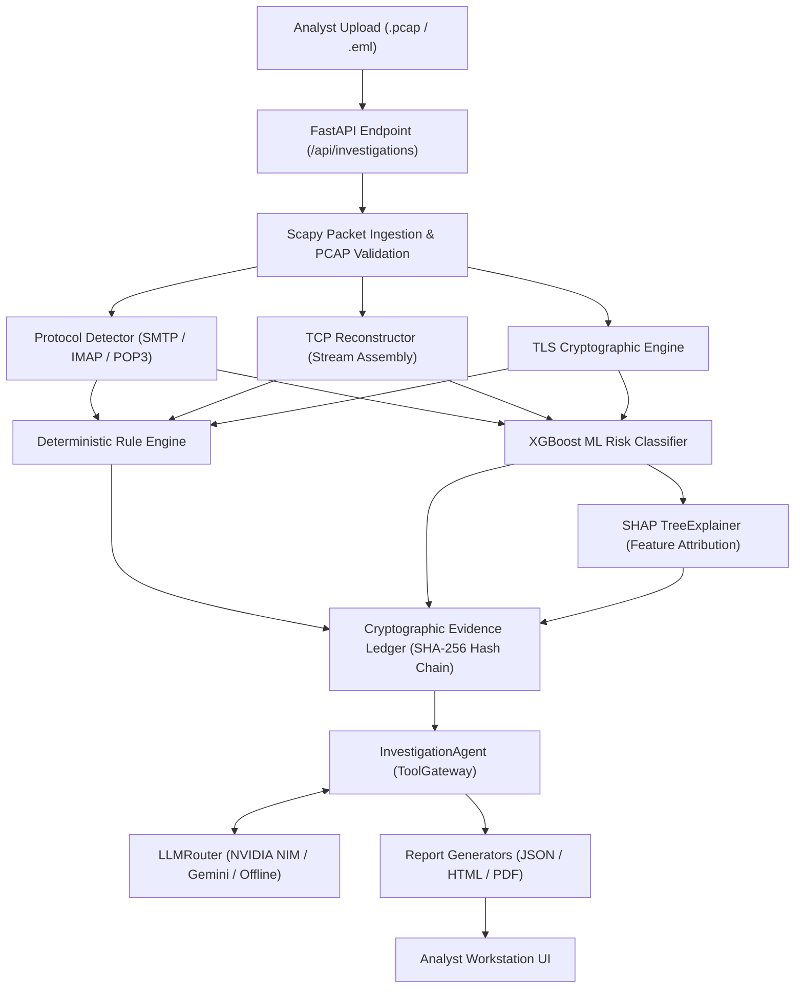

# SecureMailScope — Technical Architecture & Forensic Platform Specification

> **SIH Problem Statement SIH26159 (NTRO)**: Passive Forensic Analysis Platform for SMTP, IMAP, and POP3 PCAP/EML Network Evidence with Cryptographic Verification, Hash-Chained Evidence Ledger, Explainable ML, and Agentic AI Tool Calling.

---

## 1. Executive Summary

**SecureMailScope** is a production-grade, passive network forensic investigation platform designed to analyze captured email traffic (`.pcap`, `.pcapng`, `.cap`, `.eml`, `.msg`, `.mbox`) without active network interference. It detects protocol manipulations, plain-text credential leaks, TLS downgrades, and STARTTLS stripping attacks across SMTP, IMAP, and POP3 communications.

The platform combines deterministic packet forensic analysis, cryptographic verification, a tamper-evident SHA-256 hash-chained evidence ledger, an XGBoost risk classifier with real SHAP explainability, and an agentic LLM reasoning engine (supporting NVIDIA NIM and Google Gemini) with multi-round tool calling.

---

## 2. Full Tech Stack Specification

### 🎨 Frontend Architecture
- **Core Framework**: Native Vanilla ES6+ JavaScript (Zero heavyweight framework overhead for maximum rendering speed and zero supply-chain risk).
- **Styling & Design System**: Custom CSS3 design token system (`design-tokens.css`, `app-workstation.css`) supporting Dark/Light high-contrast cybersecurity workstation themes.
- **UI Architecture**: Single Page Application (SPA) workstation controller (`app-workstation.js`) with responsive routing, dynamic tab state management, and real-time thread rendering.
- **Iconography**: Lucide Icons SVG integration.
- **Real-time Updates**: Server-Sent Events (SSE) and WebSockets for streaming agent thought steps and forensic timeline events.
- **Data Visualizations**: Responsive SHAP feature attribution bars, risk scorecards, stream transcript inspectors, and live report previewers.

### ⚙️ Backend Architecture
- **Runtime**: Python 3.14+.
- **Web Framework**: FastAPI (Asynchronous REST API & SSE streaming).
- **Web Server**: Uvicorn / Gunicorn ASGI server.
- **Data Validation & Schemas**: Pydantic v2 (Strict data models for requests, responses, evidence, and tool outputs).
- **Database & Persistence**: SQLite3 + SQLAlchemy ORM for authenticated sessions, user management, investigation state, and immutable evidence ledgers.
- **Task Execution**: FastAPI BackgroundTasks & Asynchronous Execution Loops.

### 🔬 Network Forensics & Deep Packet Inspection
- **Packet Ingestion**: `Scapy` (Deep packet parsing, TCP stream reconstruction, payload decryption/extraction).
- **Protocol Parsers**: Custom state machine parsers for SMTP, IMAP, and POP3 (`securemailscope/forensics/protocols/`).
- **Email Parser**: `mail-parser` & `dnspython` for DKIM, SPF, DMARC, and MIME header validation.
- **System Tool Discovery**: Automated discovery and execution wrapper for `tshark`, `capinfos`, `zeek`, `tcpflow`, and `openssl`.

### 🧠 Machine Learning & Explainable AI (XGBoost + SHAP)
- **Risk Model**: `XGBoost` Gradient Boosted Decision Trees trained on network flow features and cryptographic parameters.
- **Explainability**: `SHAP` (`TreeExplainer`) for per-session feature attribution and contribution direction (Positive risk vs. Negative safe factors).
- **Metrics Engine**: Real-time benchmark calculation comparing Rule-Only Baselines vs. Hybrid ML+Rule Engines (Accuracy, Precision, Recall, F1 Score).

### 🤖 Agentic LLM & AI Reasoning Core
- **Agent Orchestrator**: `InvestigationAgent` (`securemailscope/agent/investigator.py`).
- **Tool Gateway**: `ToolGateway` (`securemailscope/tools/gateway.py`) with strict tool allowlisting, schema enforcement, and hypothesis tracking.
- **LLM Router**: `LLMRouter` (`backend/llm/router.py`) supporting automatic failover:
  1. **Primary**: NVIDIA NIM (`moonshotai/kimi-k3` / `meta/llama-3.3-70b-instruct`)
  2. **Secondary**: Google Gemini (`gemini-2.5-flash`)
  3. **Fallback**: Deterministic Rule & Ledger Synthesis (Offline/Air-gapped operation)

---

## 3. Cybersecurity Concepts & Threat Models

### 🛡️ Threat Scenarios Analyzed

1. **STARTTLS Stripping Attack (MITM)**
   - **Mechanism**: An adversary intercepts the initial unencrypted SMTP `EHLO` response and strips the `250-STARTTLS` advertisement, or intercepts the client's `STARTTLS` command and returns a `554 TLS not available` response.
   - **Detection**: SecureMailScope compares advertised server capabilities against client command sequences and checks for unencrypted sensitive commands (`AUTH LOGIN`, `MAIL FROM`) following a stripped handshake.

2. **Plain-Text Credential Transmission (`RULE-CLEARTEXT-AUTH`)**
   - **Mechanism**: Sending `AUTH LOGIN`, `AUTH PLAIN`, `USER`, or `PASS` commands over unencrypted port 25/110/143 without prior TLS establishment.
   - **Detection**: Identifies base64-encoded or raw passwords transmitted in non-TLS TCP streams.

3. **Cryptographic Weaknesses & TLS Downgrades**
   - **Mechanism**: Forcing legacy protocols (`SSLv3`, `TLS 1.0`, `TLS 1.1`) or vulnerable cipher suites (`RC4`, `3DES`, `EXPORT`, `NULL`).
   - **Detection**: Evaluates Client Hello and Server Hello TLS extensions, cipher suites, and protocol versions.

4. **Certificate Anomalies & Clock Skew**
   - **Mechanism**: Expired certificates, self-signed certificates in untrusted chains, mismatch between Server Name Indication (SNI) and Certificate Subject Alt Names (SAN), or certificate clock skew.
   - **Detection**: Parses X.509 certificate fields using PyOpenSSL/Scapy cryptography tools.

5. **TCP Anomalies Post-STARTTLS**
   - **Mechanism**: Injection of TCP `RST` packets immediately after `STARTTLS` negotiation to force clients to retry in plaintext.
   - **Detection**: Tracks TCP flags (`RST`, `FIN`, `ACK`) correlated with application layer protocol states.

6. **Email Authentication Spoofing (SPF / DKIM / DMARC)**
   - **Mechanism**: Forged `From` headers failing SPF alignment or missing cryptographic DKIM signatures.
   - **Detection**: Validates email headers and queries DNS records for domain policy compliance.

---

## 4. Technical Architecture & Data Flow



### 🔒 Tamper-Evident Evidence Ledger (SHA-256 Hash Chaining)

SecureMailScope enforces **immutable forensic integrity** using a cryptographic ledger:

1. **Evidence Record Structure**:
   ```json
   {
     "evidence_id": "E-1A6BE1",
     "investigation_id": "INV-112CF10E",
     "evidence_type": "PROTOCOL_ANOMALY",
     "claim": "STARTTLS capability advertised but client issued AUTH in plaintext.",
     "source_tool": "smtp_analyzer",
     "confidence": 1.0,
     "prev_entry_hash": "aef890...3b",
     "entry_hash": "7c91d4...1e"
   }
   ```
2. **Hash Chain Formula**:
   $$\text{entry\_hash} = \text{SHA256}(\text{evidence\_id} + \text{investigation\_id} + \text{claim} + \text{prev\_entry\_hash})$$
3. **Database Triggers**: SQLite `BEFORE UPDATE` and `BEFORE DELETE` triggers reject any manual modifications to evidence ledger rows, guaranteeing forensic auditability.

---

## 5. Complete Available Tools Registry

SecureMailScope exposes **12 core forensic tools** via the `ToolGateway` for both automated rule evaluation and agentic LLM tool calls:

| Tool Identifier | Module Source | Purpose & Functionality |
| :--- | :--- | :--- |
| `inspect_pcap` | `forensics/capture.py` | Parses PCAP metadata, packet counts, duration, and protocol distribution. |
| `list_sessions` | `forensics/tcp_stream.py` | Extracts TCP streams, IP pairs, ports, and payload sizes. |
| `extract_smtp` | `forensics/protocols/smtp.py` | Parses SMTP command sequences (`EHLO`, `STARTTLS`, `MAIL`, `RCPT`, `DATA`, `AUTH`). |
| `extract_imap` | `forensics/protocols/imap.py` | Parses IMAP commands (`CAPABILITY`, `STARTTLS`, `LOGIN`, `AUTHENTICATE`). |
| `extract_pop3` | `forensics/protocols/pop3.py` | Parses POP3 command state (`STLS`, `USER`, `PASS`, `STAT`, `RETR`). |
| `analyze_tls` | `forensics/tls.py` | Evaluates TLS Handshake versions, Cipher Suites, SNI, and extensions. |
| `extract_certificate` | `forensics/tls.py` | Extracts X.509 certificate subject, issuer, validity dates, and SAN fields. |
| `check_completeness` | `forensics/capture.py` | Computes completeness ratio based on TCP handshake (`SYN`, `SYN-ACK`, `ACK`) and teardown. |
| `evaluate_rules` | `forensics/rules.py` | Runs deterministic security rules (`RULE-STARTTLS-STRIP`, `RULE-CLEARTEXT-AUTH`, etc.). |
| `run_ml_classifier` | `ml/model.py` | Runs XGBoost risk classifier and generates top 5 SHAP feature explanations. |
| `search_threat_intel` | `tools/gateway.py` | Performs IP/Domain threat intelligence lookup (SSRF-protected). |
| `finalize_finding` | `evidence/ledger.py` | Records a verified security finding into the hash-chained ledger with evidence citations. |

### 🛠️ Discovered Native System Utilities Wrapper
The backend automatically detects and leverages installed host system utilities:
- **`tshark`**: Advanced packet parsing and filter evaluation.
- **`capinfos`**: Detailed PCAP statistics and capture file verification.
- **`zeek`**: Network security monitoring logs parser.
- **`tcpflow`**: Reconstructing multi-connection TCP payloads.
- **`openssl`**: Certificate chain verification and cipher strength testing.

---

## 6. Report Generation & Exports

SecureMailScope includes **three production report generators**:

1. **JSON Reporter** (`reports/json_reporter.py`): Structured machine-readable report containing evidence ledgers, findings, risk posture, and AI summaries.
2. **HTML Reporter** (`reports/html_reporter.py`): Standalone interactive HTML report with embedded CSS styling, evidence badges, and executive briefing.
3. **PDF Reporter** (`reports/pdf_reporter.py`): Audit-ready PDF report generated via ReportLab with tables, risk badges, and cryptographic verification logs.

---

## 7. Verification & Quality Assurance

- **Test Suite**: 87 passing unit and integration tests (`tests/`).
- **Ledger Verification**: Pass 100% hash chain verification test (`test_ledger_integrity.py`).
- **Failure Injection**: Passed malicious input, path traversal, disallowed extensions, empty files, and tool allowlisting security tests (`test_failure_injection.py`).
- **Live Verification**: Verified against real Wireshark SMTP and IMAP capture files (`samples/wireshark_real_smtp.pcap`).
