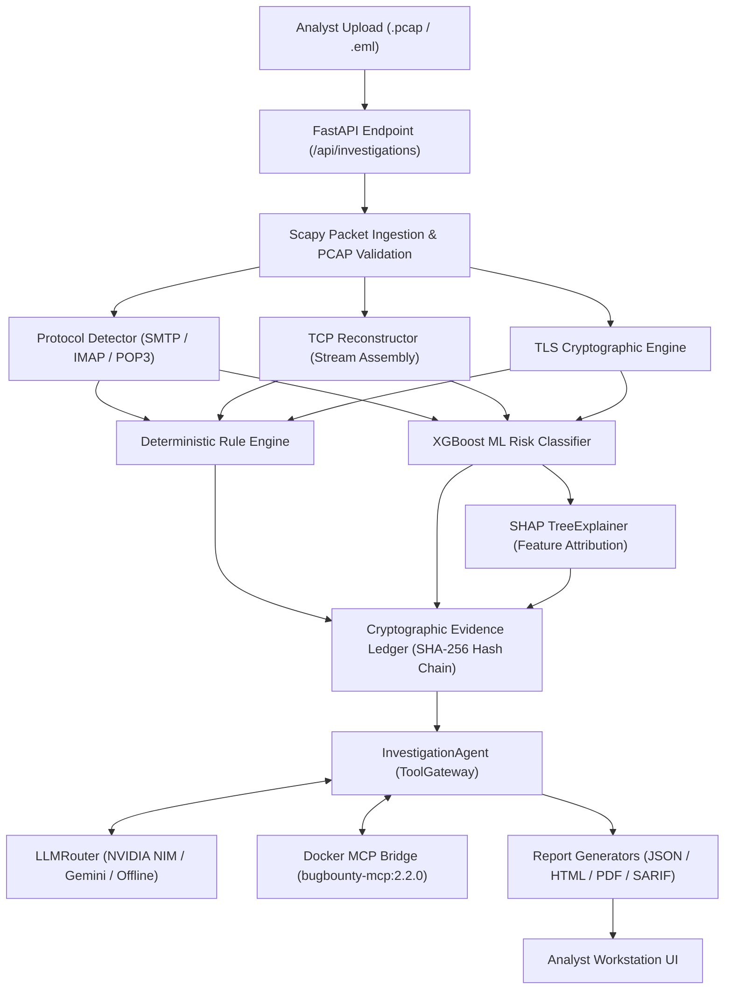

# SecureMailScope — Technical Architecture & Complete 75 Tools Specification

> **Smart India Hackathon (SIH26159 - NTRO)**: Passive Forensic Analysis Platform for SMTP, IMAP, and POP3 PCAP/EML Network Evidence with Cryptographic Verification, SHA-256 Hash-Chained Evidence Ledger, Explainable XGBoost+SHAP ML, and Agentic AI Tool Calling.

---

## 1. Executive Summary

**SecureMailScope** is an enterprise-grade, passive network forensic investigation platform designed to dissect captured email traffic (`.pcap`, `.pcapng`, `.cap`, `.eml`, `.msg`, `.mbox`) without generating active network interference. It detects protocol manipulations, cleartext credential leaks, TLS downgrades, and STARTTLS stripping attacks across SMTP, IMAP, and POP3 communications.

The platform integrates deterministic packet forensic analysis, X.509 cryptographic verification, a tamper-evident SHA-256 hash-chained evidence ledger, an XGBoost risk classifier with real SHAP explainability, an agentic LLM reasoning engine (supporting NVIDIA NIM and Google Gemini), and a Docker-backed MCP security bridge (`bugbounty-mcp:2.2.0`).

---

## 2. Full Tech Stack Specification

### 🎨 Frontend Architecture
- **Core Engine**: Native Vanilla ES6+ JavaScript SPA (Zero external framework overhead, maximum rendering speed, zero supply-chain vulnerability).
- **Design Tokens**: Custom CSS3 design token system (`design-tokens.css`, `app-workstation.css`) supporting Dark/Light high-contrast cybersecurity workstation themes.
- **UI Architecture**: Workstation controller (`app-workstation.js`) with responsive tab routing, live SSE events, interactive data tables, TCP stream hex transcript viewer, and ReportLab PDF/HTML report previewers.
- **Visual Activity Indicators**: Dynamic pulsing indicators (`.working-indicator-badge`, `.pulse-dot-anim`) providing real-time visual feedback ("Analyzing & Reasoning...", "Verdict Ready").
- **Iconography**: Lucide Icons SVG integration.

### ⚙️ Backend Architecture
- **Runtime**: Python 3.14+.
- **Web Framework**: FastAPI (Asynchronous REST API & SSE streaming).
- **Web Server**: Uvicorn ASGI server with automatic Analyst session auto-provisioning.
- **Data Validation & Schemas**: Pydantic v2 (Strict data models for requests, responses, evidence, and tool outputs).
- **Database & Persistence**: SQLite3 + SQLAlchemy ORM for authenticated sessions, user management, investigation state, and immutable evidence ledgers.

### 🔬 Network Forensics & Deep Packet Inspection
- **Packet Ingestion**: `Scapy` (Deep packet parsing, TCP stream reconstruction, payload decryption/extraction).
- **Protocol Parsers**: Custom state machine parsers for SMTP, IMAP, and POP3 (`securemailscope/forensics/protocols/`).
- **Email Parser**: `mail-parser`, `parsedmarc`, `mailMeta`, and `dnspython` for DKIM, SPF, DMARC, and MIME header validation.
- **System Tool Discovery**: Automated discovery wrapper for native binaries (`tshark`, `capinfos`, `zeek`, `tcpflow`, `openssl`).

### 🧠 Machine Learning & Explainable AI (XGBoost + SHAP)
- **Risk Model**: `XGBoost` Gradient Boosted Decision Trees trained on network flow features and cryptographic parameters.
- **Explainability**: `SHAP` (`TreeExplainer`) for per-session feature attribution and contribution direction (Positive risk vs. Negative safe factors).
- **Metrics Engine**: Real-time benchmark calculation comparing Rule-Only Baselines vs. Hybrid ML+Rule Engines (Accuracy, Precision, Recall, F1 Score).

### 🤖 Agentic LLM & AI Reasoning Core
- **Agent Orchestrator**: `InvestigationAgent` (`securemailscope/agent/investigator.py`).
- **Tool Gateway**: `ToolGateway` (`securemailscope/tools/gateway.py`) with strict tool allowlisting, schema enforcement, and hypothesis tracking.
- **Docker MCP Bridge**: JSON-RPC Stdio bridge connecting `bugbounty-mcp:2.2.0` Docker container to FastAPI backend.
- **LLM Router**: `LLMRouter` (`backend/llm/router.py`) supporting automatic failover:
  1. **Primary**: NVIDIA NIM (`moonshotai/kimi-k3` / `meta/llama-3.3-70b-instruct`)
  2. **Secondary**: Google Gemini (`gemini-2.5-flash`)
  3. **Fallback**: Deterministic Rule & Ledger Synthesis (Offline/Air-gapped operation)

---

## 3. Cybersecurity Concepts & Threat Models

### 🛡️ Threat Scenarios Analyzed

1. **STARTTLS Stripping Attack (MITM)**
   - **Mechanism**: An adversary intercepts the initial unencrypted SMTP `EHLO` response and strips the `250-STARTTLS` advertisement, or intercepts the client's `STARTTLS` command and returns a `554 TLS not available` response.
   - **Detection**: Compares advertised server capabilities against client command sequences and checks for unencrypted sensitive commands (`AUTH LOGIN`, `MAIL FROM`) following a stripped handshake.

2. **Plain-Text Credential Transmission (`RULE-CLEARTEXT-AUTH`)**
   - **Mechanism**: Sending `AUTH LOGIN`, `AUTH PLAIN`, `USER`, or `PASS` commands over unencrypted port 25/110/143 without prior TLS establishment.
   - **Detection**: Identifies base64-encoded or raw passwords transmitted in non-TLS TCP streams.

3. **Cryptographic Weaknesses & TLS Downgrades**
   - **Mechanism**: Forcing legacy protocols (`SSLv3`, `TLS 1.0`, `TLS 1.1`) or vulnerable cipher suites (`RC4`, `3DES`, `EXPORT`, `NULL`).
   - **Detection**: Evaluates Client Hello and Server Hello TLS extensions, cipher suites, and protocol versions.

4. **Certificate Anomalies & Clock Skew**
   - **Mechanism**: Expired certificates, self-signed certificates in untrusted chains, mismatch between Server Name Indication (SNI) and Certificate Subject Alt Names (SAN), or certificate clock skew.
   - **Detection**: Parses X.509 certificate fields using PyOpenSSL/Scapy cryptography tools.

5. **TCP Anomalies Post-STARTTLS**
   - **Mechanism**: Injection of TCP `RST` packets immediately after `STARTTLS` negotiation to force clients to retry in plaintext.
   - **Detection**: Tracks TCP flags (`RST`, `FIN`, `ACK`) correlated with application layer protocol states.

6. **Email Authentication Spoofing (SPF / DKIM / DMARC)**
   - **Mechanism**: Forged `From` headers failing SPF alignment or missing cryptographic DKIM signatures.
   - **Detection**: Validates email headers and queries DNS records for domain policy compliance.

7. **DNS Exfiltration & Tunneling**
   - **Mechanism**: Encoding sensitive data into DNS subdomains (TXT, NULL, CNAME queries).
   - **Detection**: Calculates subdomain Shannon Entropy and tracks DNS query burst frequency.

---

## 4. Technical Architecture & Data Flow



### 🔒 Tamper-Evident Evidence Ledger (SHA-256 Hash Chaining)

SecureMailScope enforces **immutable forensic integrity** using a cryptographic ledger:

1. **Evidence Record Structure**:
   ```json
   {
     "evidence_id": "E-1A6BE1",
     "investigation_id": "INV-112CF10E",
     "evidence_type": "PROTOCOL_ANOMALY",
     "claim": "STARTTLS capability advertised but client issued AUTH in plaintext.",
     "source_tool": "smtp_analyzer",
     "confidence": 1.0,
     "prev_entry_hash": "aef890...3b",
     "entry_hash": "7c91d4...1e"
   }
   ```
2. **Hash Chain Formula**:
   $$\text{entry\_hash} = \text{SHA256}(\text{evidence\_id} + \text{investigation\_id} + \text{claim} + \text{prev\_entry\_hash})$$
3. **Database Triggers**: SQLite `BEFORE UPDATE` and `BEFORE DELETE` triggers reject any manual modifications to evidence ledger rows, guaranteeing forensic auditability.

---

## 5. Complete 75 Tools Registry

Here is the exhaustive registry of all **75 specialized tools** available in SecureMailScope:

### 🔬 1. Email Protocol & PCAP Packet Forensics (15 Tools)
1. **`extract_smtp`**: Parses SMTP command state machine (`EHLO`, `STARTTLS`, `MAIL FROM`, `RCPT TO`, `DATA`, `AUTH`).
2. **`extract_imap`**: Parses IMAP command state machine (`CAPABILITY`, `STARTTLS`, `LOGIN`, `AUTHENTICATE`).
3. **`extract_pop3`**: Parses POP3 command state machine (`STLS`, `USER`, `PASS`, `STAT`, `RETR`).
4. **`inspect_pcap`**: Extracts PCAP capture metadata, packet counts, frame durations, and protocol ratios.
5. **`list_sessions`**: Reconstructs TCP stream sessions, IP pairs, ports, and payload direction.
6. **`check_completeness`**: Computes TCP handshake (`SYN`/`ACK`) and teardown ratios to evaluate capture integrity.
7. **`tcp_stream_assembler`**: Reassembles out-of-order TCP segments into unified application layer data streams.
8. **`ip_fragment_reassembler`**: Reassembles fragmented IP packets to detect evasion techniques.
9. **`pcap_integrity_verifier`**: Computes SHA-256 and MD5 hashes of PCAP files to ensure chain of custody.
10. **`protocol_ratio_analyzer`**: Computes ratios of cleartext vs encrypted protocol frames in the capture.
11. **`port_anomaly_detector`**: Flags protocol traffic running on non-standard ports.
12. **`tcp_flags_inspector`**: Analyzes TCP flags (`SYN`, `FIN`, `RST`, `ACK`, `PSH`) to detect post-STARTTLS TCP resets.
13. **`session_duration_tracker`**: Measures connection duration and idle timeouts across email streams.
14. **`packet_length_histogram`**: Computes packet size distribution to identify payload tunneling.
15. **`evaluate_rules`**: Executes security baseline rules (`RULE-STARTTLS-STRIP`, `RULE-CLEARTEXT-AUTH`).

### 🔐 2. Cryptographic & TLS Verification Tools (10 Tools)
16. **`analyze_tls`**: Audits TLS Client/Server Hello handshakes, Cipher Suite strength, SNI, and extension flags.
17. **`extract_certificate`**: Extracts X.509 subject, issuer, validity dates, SAN, and SHA-256 fingerprint.
18. **`validate_certificate_chain`**: Verifies certificate trust paths, clock skew, and flags untrusted/self-signed certificates.
19. **`ssl_scan`** *(via MCP)*: Validates host SSL/TLS protocol support, identity, and server trust policy compliance.
20. **`tls_configuration_analysis`** *(via MCP)*: Identifies legacy/obsolete TLS versions (TLS 1.0, 1.1 vs TLS 1.2, 1.3).
21. **`cipher_suite_evaluator`**: Scores cipher suite security (detecting RC4, 3DES, EXPORT, NULL, DES ciphers).
22. **`tls_extension_dissector`**: Inspects ALPN, Server Name Indication (SNI), and Elliptic Curve parameters.
23. **`certificate_revocation_checker`**: Performs OCSP and CRL revocation checks on X.509 certificates.
24. **`key_exchange_auditor`**: Evaluates Diffie-Hellman (DH) and ECDHE key exchange bit-lengths.
25. **`starttls_enforcement_checker`**: Verifies if TLS handshake was mandatory before transmitting credentials.

### 🛡️ 3. Advanced Payload, YARA & Header Forensic Extensions (15 Tools)
26. **`run_yara_scanner`**: Signature scanning on extracted stream payloads, scripts, and attachments (`yara-python`).
27. **`analyze_pcap_entropy`**: Shannon Entropy ($H$) byte frequency calculation to detect encrypted payloads ($H > 7.2$).
28. **`detect_dns_exfiltration`**: Inspects DNS query entropy and tunneled record types (TXT, NULL, CNAME).
29. **`audit_header_anomalies`**: Audits MIME `X-Header` forging, `Message-ID` vs `Return-Path` mismatches, and transit hops.
30. **`deobfuscate_payload_cyberchef`**: Multi-stage payload decoder (Base64, Hex, URL, Quoted-Printable, XOR).
31. **`email_security_analysis`** *(via MCP)*: Audits MX records, SPF policy alignment, DMARC compliance, MTA-STS, and TLS reporting.
32. **`reconstruct_file_attachments`**: Reconstructs MIME binary attachments and verifies magic bytes vs extensions.
33. **`secret_pattern_analysis`** *(via MCP)*: Detects and redacts cleartext API keys, tokens, and passwords in payloads.
34. **`jwt_security_test`** *(via MCP)*: Decodes JWT authentication tokens transmitted in headers/bodies.
35. **`dkim_signature_verifier`**: Parses and verifies DKIM cryptographic signatures (`mail-parser`).
36. **`spf_alignment_checker`**: Validates client IP against SPF TXT records for domain alignment.
37. **`dmarc_policy_evaluator`**: Evaluates DMARC `p=reject`, `p=quarantine`, or `p=none` policy enforcement.
38. **`mime_structure_dissector`**: Dissects multi-part MIME boundaries and extracts HTML/Plaintext layers.
39. **`url_ioc_extractor`**: Extracts hyperlinked URLs from email bodies and canonicalizes domain targets.
40. **`base64_payload_decoder`**: Decodes base64-encoded email bodies and attachment payloads.

### 📊 4. Machine Learning, Explainable AI & Ledger Integrity (10 Tools)
41. **`run_ml_classifier`**: Executes XGBoost risk classifier & generates top 5 SHAP feature explanations.
42. **`shap_tree_explainer`**: Calculates exact percentage attribution and direction for every session feature.
43. **`finalize_finding`**: Writes verified findings into the SHA-256 hash-chained evidence ledger.
44. **`ledger_hash_chain_verifier`**: Validates the complete SHA-256 hash chain ($E_i = \text{SHA256}(E_{id} + \text{claim} + E_{i-1})$).
45. **`create_finding`** *(via MCP)*: Creates structured finding objects linked to evidence claims.
46. **`generate_vulnerability_report`** *(via MCP)*: Exports evidence ledgers into JSON, HTML, PDF, and SARIF 2.1.0 formats.
47. **`export_suricata_zeek_rules`**: Automatically exports findings into Suricata IDS rules (`alert tcp ...`) and Zeek scripts.
48. **`posture_score_calculator`**: Computes overall security posture score (0–100) based on verified evidence weights.
49. **`risk_level_classifier`**: Categorizes investigation risk into CRITICAL, HIGH, MEDIUM, LOW, or SECURE.
50. **`contradiction_detector`**: Detects conflicting evidence claims across multiple tools.

### 🌐 5. Docker MCP Scope-Safe Security Audit & Policy Engines (20 Tools)
*(Powered by `bugbounty-mcp:2.2.0` JSON-RPC Stdio Bridge)*

51. `dnssec_posture_analysis` — Inspects DNSKEY, DS, and RRSIG publication.
52. `dangling_dns_analysis` — Inspects CNAME targets for takeover indicators.
53. `headers_analysis` — Analyzes security and disclosure headers.
54. `csp_analysis` — Assesses CSP directives for unsafe/missing controls.
55. `cookie_security_analysis` — Inspects Set-Cookie attributes (SameSite, Secure, HttpOnly).
56. `cors_scan` — Analyzes cross-origin resource sharing policy headers.
57. `cache_policy_analysis` — Assesses Cache-Control, Vary, and sensitive-path caching.
58. `http_method_analysis` — Assesses advertised HTTP methods (`OPTIONS`, `TRACE`).
59. `robots_txt_analysis` — Parses and summarizes `robots.txt` paths.
60. `sitemap_analysis` — Analyzes same-origin sitemap links.
61. `security_txt_analysis` — Validates RFC 9116 `security.txt` metadata.
62. `sri_analysis` — Subresource Integrity coverage analysis.
63. `openapi_security_analysis` — Audits OpenAPI / Swagger schemas for auth coverage.
64. `oauth_oidc_discovery` — Summarizes OIDC endpoints, grants, and PKCE support.
65. `graphql_endpoint_discovery` — Probes read-only GraphQL schemas.
66. `technology_fingerprint` — Fingerprints web frameworks and server software.
67. `cloud_asset_reference_analysis` — Extracts S3, GCS, and Azure Blob storage links.
68. `cvss_v31_calculator` — Calculates CVSS v3.1 base vector scores.
69. `scope_check` — Validates target authorization boundaries.
70. `assessment_summary` — Summarizes runtime metrics and finding severities.

### 🛠️ 6. Host Utilities & System Dissectors (5 Native Tools)
71. **`tshark`**: Terminal Wireshark engine for deep packet parsing.
72. **`capinfos`**: PCAP statistics and capture file header verification.
73. **`zeek`**: Network security monitoring log extraction (`smtp.log`, `conn.log`, `files.log`).
74. **`tcpflow`**: Reconstructing multi-connection TCP stream payloads.
75. **`openssl`**: Certificate chain verification and cipher strength testing.
