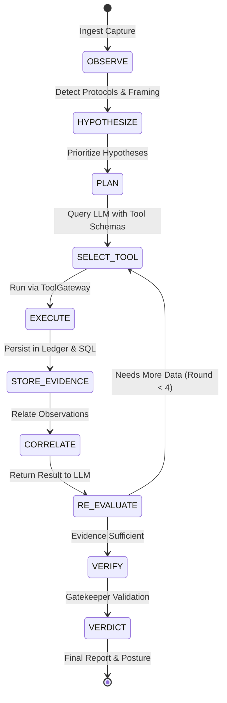

# SecureMailScope — Agentic AI & Tool Calling

## 1. Overview
SecureMailScope employs real, structured LLM tool/function calling rather than simulated or deterministic chatbot approximations. The agent uses external LLM APIs (NVIDIA NIM as primary, Google Gemini as secondary fallback) to dynamically inspect captures, formulate hypotheses, select forensic tools, analyze intermediate outputs, and verify security findings.

## 2. Agent State Machine
The agent transitions through an explicit 10-state finite automaton:

## 3. Allowlisted Tool Schemas
The LLM is provided with 12 structured tool definitions:
1. `inspect_pcap`: Extracts packet count, timestamps, SHA-256/MD5 hashes.
2. `list_sessions`: Discovers SMTP, IMAP, and POP3 conversations across TCP streams.
3. `extract_smtp`: Tracks EHLO, STARTTLS negotiation, and plaintext downgrade continuation.
4. `extract_imap`: Tracks IMAP capabilities, STARTTLS, and cleartext AUTH.
5. `extract_pop3`: Tracks POP3 STLS capability and credentials.
6. `analyze_tls`: Extracts ClientHello/ServerHello, cipher suites, and forward secrecy.
7. `extract_certificate`: Obtains observable X.509 certs (TLS <= 1.2) or reports NOT_OBSERVABLE (TLS 1.3).
8. `check_completeness`: Computes TCP sequence gaps, retransmissions, and truncation.
9. `evaluate_rules`: Deterministic rule validation against evidence context.
10. `run_ml_classifier`: XGBoost prediction and SHAP feature attribution.
11. `search_threat_intel`: Real web intelligence search via Tavily for observable entities.
12. `finalize_finding`: Submits candidate findings for Gatekeeper validation.

## 4. Multi-Round Loop Execution
In both investigation execution and interactive `/api/investigations/{id}/agent/chat`:
1. The backend builds a grounded prompt containing active investigation metadata, capture completeness, detected protocols, and up to 20 immutable Evidence IDs.
2. The ChatRequest is dispatched to `LLMRouter` with `tools=LLM_TOOL_SCHEMAS`.
3. If the LLM selects one or more tools, the backend dispatches each call through `ToolGateway.execute_tool()`.
4. Tool outputs are appended to the conversation history as `ChatMessage(role="tool")`.
5. The LLM re-evaluates the tool outputs in the next iteration.
6. Each step is persisted in the database as an `AgentStepModel` record.
7. Once the LLM provides a final text response (or the maximum round limit of 4 is reached), the agent concludes and outputs the evidence-grounded answer.

## 5. Failure and Availability Guarantees
- **No Mocking**: When both NVIDIA NIM and Gemini are unreachable, the system explicitly returns `ai_unavailable: true` with a clear message: `"LLM provider unavailable — deterministic forensic analysis remains active"`.
- **No Deterministic Masking**: Deterministic reasoning is strictly kept in the passive forensic engine; it is never fabricated as live LLM output.
