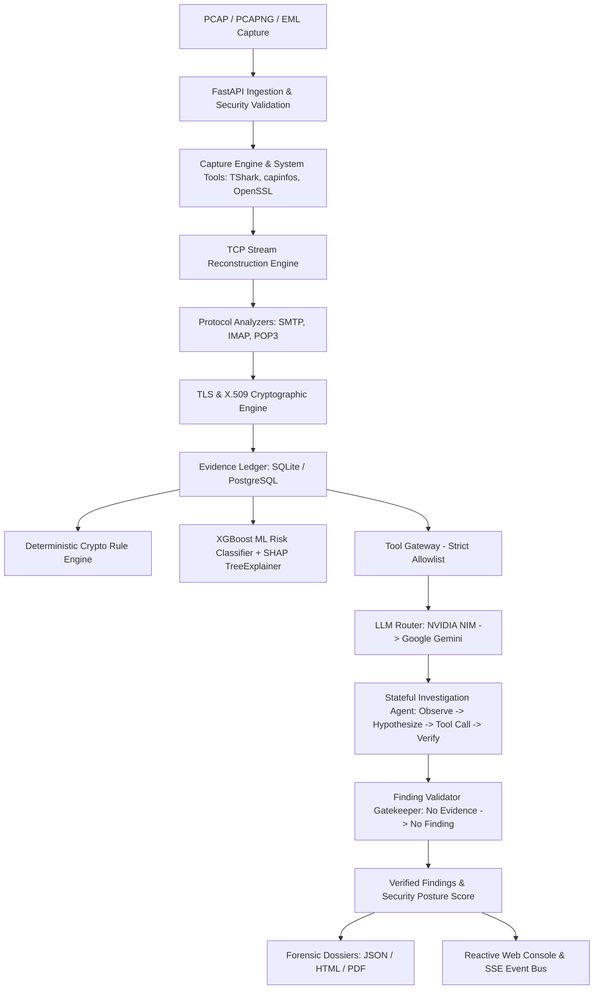

# SecureMailScope — Architecture Specification

## 1. System Overview
SecureMailScope is an evidence-first, AI-assisted cryptographic forensic platform designed for passive analysis of email communications across SMTP, IMAP, and POP3 network captures (PCAP/PCAPNG) and email artifacts (.eml).

The system enforces a strict architectural boundary between:
1. **Deterministic Passive Forensic Layer**: Protocol state machines, sequence reconstruction, TLS handshake parsing, certificate evaluation, capture completeness calculation, and feature attribution.
2. **Agentic Reasoning Layer**: External LLMs (NVIDIA NIM as primary, Google Gemini as fallback) operating through function/tool calling over an allowlisted Tool Gateway.

## 2. Core Subsystems

### 2.1 Storage & Persistence
- **SQLAlchemy ORM** with SQLite default and PostgreSQL production support.
- **Relational Models**:
  - `UserModel`: Authentication credentials with PBKDF2-HMAC-SHA256 (600,000 iterations), salt, roles.
  - `InvestigationModel`: Investigation status, artifact metadata, posture scores, foreign-keyed to user.
  - `EvidenceModel`: Persisted atomic forensic observations with cryptographic SHA-256 provenance chains.
  - `FindingModel`: Verified security violations strictly citing persisted Evidence IDs.
  - `ForensicSessionModel`: Reconstructed bidirectional TCP conversations.
  - `AgentRunModel` & `AgentStepModel`: Multi-round LLM agent reasoning steps, selected tools, arguments, and outcomes.
  - `ToolExecutionModel`: Full audit record of every tool executed through the Tool Gateway.
  - `AuditEventModel`: Detailed telemetry on LLM provider attempts, latencies, failures, and routing decisions.

### 2.2 Security & Ingestion
- Upload extensions restricted to `.pcap`, `.pcapng`, `.cap`, `.eml`.
- File magic bytes validated before disk write (PCAP LE/BE, PCAPNG Section Header, GZIP PCAP).
- Strict filename sanitization and path traversal prevention.
- All external binaries executed via `subprocess.run(shell=False)` with argument arrays and timeouts.
- Bearer session token revocation list for immediate session termination upon logout.

### 2.3 Deterministic Forensics
- **SMTP**: RFC-5321 finite state machine tracking EHLO/HELO capabilities, STARTTLS negotiation, 220 Ready acknowledgments, and plaintext command continuation.
- **IMAP**: RFC-3501 state machine tracking CAPABILITY, STARTTLS, OK responses, and cleartext AUTHENTICATE/LOGIN.
- **POP3**: RFC-1939 state machine tracking STLS advertisement, +OK response, and USER/PASS credentials.
- **TLS**: Passive ClientHello/ServerHello dissection, cipher suite identification, forward secrecy (PFS) verification, and deprecated protocol detection (TLS 1.0, TLS 1.1).
- **TLS 1.3 Honesty**: Honest recognition that post-ServerHello handshake messages (including Certificate) are encrypted in TLS 1.3; records `NOT_OBSERVABLE` rather than fabricating certificates.
- **X.509**: Observable certificates parsed using `cryptography.x509` for validity periods, subject/issuer, self-signed status, and public key sizes.
- **Capture Completeness**: TCP sequence gap analysis, retransmission ratio calculation, and packet truncation tracking. Completeness < 60% flags findings as `INCONCLUSIVE`.

### 2.4 Machine Learning & SHAP Explainability
- **XGBoost Classifier** (`CryptoRiskClassifier`) with 15 normalized features covering protocol, crypto, and transport characteristics.
- **SHAP TreeExplainer**: Returns feature-level SHAP values, distinguishing positive risk contributors from negative safe contributors.
- **Scientific Benchmark**: Evaluates ML vs Rule-Only baseline using stratified train/test split.

### 2.5 Agentic AI & Tool Calling
- **Priority Routing**: NVIDIA NIM (`moonshotai/kimi-k3`) -> Google Gemini (`gemini-2.5-flash`).
- **Dynamic Tool Calling**: LLM receives 12 structured tool schemas, emits function calls, backend executes via `ToolGateway`, returns structured results, and iterates up to 4 rounds.
- **No Mocking**: When both external LLM APIs fail, the system explicitly returns `LLM unavailable` while keeping all deterministic forensic results accessible.
