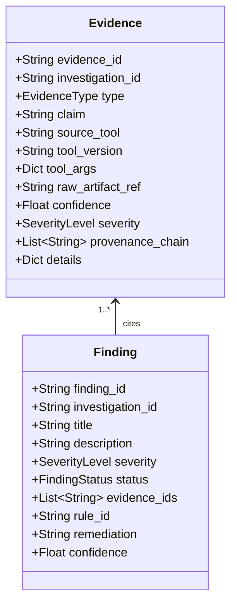

# SecureMailScope — Evidence Ledger & Finding Validation

## 1. Evidence-First Architecture
SecureMailScope enforces an ironclad product rule: **"No Evidence -> No Finding"**.
No finding can be registered, displayed in reports, or scored in security postures unless it is linked to one or more persisted, immutable `Evidence` records stored in the SQLite `evidence` table.

## 2. Evidence Taxonomy (`EvidenceType`)
- `OBSERVED`: Raw factual extraction directly observed from packet payloads (e.g. `250-STARTTLS` in TCP stream 0).
- `DERIVED`: Computed analytical metrics (e.g. Capture Completeness 80.0%, TCP sequence gaps = 0).
- `CRYPTO_RULE_TRIGGERED`: Direct deterministic violation triggered by cryptographic rules (e.g. STARTTLS Stripping).
- `ML_ATTRIBUTED`: Risk classification produced by XGBoost with SHAP feature attribution.
- `EXTERNAL_INTELLIGENCE`: Public reputation or web data acquired from DNS or Tavily (classified as secondary context).

## 3. Finding Validation Gatekeeper (`FindingValidator`)
The `FindingValidator` operates as an unconditional gatekeeper before any finding is admitted into the ledger:

1. **Evidence Grounding Check**: If `len(finding.evidence_ids) == 0`, raises `EvidenceValidationError` immediately.
2. **Ledger Existence Check**: Every cited Evidence ID is looked up in the database. If any ID does not exist, the finding is rejected.
3. **Investigation Isolation Check**: Every cited Evidence ID must match the `investigation_id` of the finding. Cross-investigation citations raise `EvidenceValidationError`.
4. **Provenance Integrity Check**: Every cited Evidence item must have a non-empty `provenance_chain` demonstrating audit traceability back to the source tool and artifact.
5. **Quality Downgrade Check**: If the capture completeness for the investigation is below 60%, findings are marked `INCONCLUSIVE` rather than `VERIFIED`.

## 4. Security Posture Scoring Formula
Posture scores range from 0 to 100, calculated deterministically from verified findings:

$$\text{Base Score} = 100$$
$$\text{Deductions} = \sum (\text{Critical} \times 30) + (\text{High} \times 20) + (\text{Medium} \times 10) + (\text{Low} \times 5)$$
$$\text{Overall Posture} = \max(0, \min(100, \text{Base Score} - \text{Deductions}))$$

- **Risk Levels**:
  - `90 - 100`: SECURE (Low Risk)
  - `70 - 89`: MEDIUM RISK
  - `40 - 69`: HIGH RISK
  - `0 - 39`: CRITICAL RISK
