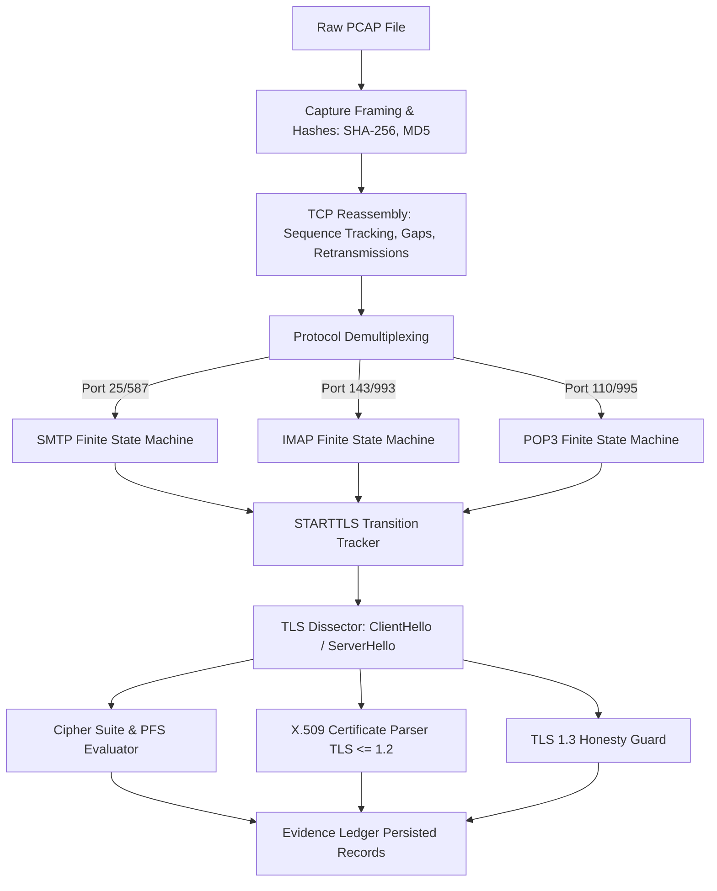

# SecureMailScope — Forensic Analysis Pipeline

## 1. Deterministic Extraction Pipeline
The passive analysis pipeline processes raw network packet captures without transmitting network packets or depending on external cloud services for factual evidence extraction.

## 2. Protocol Analyzers

### 2.1 SMTP State Machine (`SMTPAnalyzer`)
- Tracks RFC-5321 commands and server numeric responses:
  - `EHLO` / `HELO` banner advertisement.
  - Presence of `250-STARTTLS` or `250 STARTTLS` capability.
  - Client issuance of `STARTTLS`.
  - Server `220 2.0.0 Ready to start TLS` acknowledgment.
- **STARTTLS Stripping Violation**:
  - Established when `250-STARTTLS` was advertised and acknowledged, but subsequent TCP stream continues in plaintext SMTP (`MAIL FROM:`, `RCPT TO:`, `AUTH LOGIN`) without a TLS `ClientHello` handshake message.

### 2.2 IMAP State Machine (`IMAPAnalyzer`)
- Tracks RFC-3501 tagging and response codes:
  - `* OK [CAPABILITY ... STARTTLS ...]`
  - `tag STARTTLS` command.
  - `tag OK Begin TLS negotiation now`.
  - Detection of cleartext `LOGIN` or `AUTHENTICATE PLAIN` credentials when STARTTLS was offered but ignored.

### 2.3 POP3 State Machine (`POP3Analyzer`)
- Tracks RFC-1939 capabilities and transitions:
  - `CAPA` response containing `STLS`.
  - Client `STLS` command and `+OK` acknowledgment.
  - Cleartext `USER` / `PASS` transmission in unencrypted streams.

### 2.4 TLS Handshake Dissector (`TLSEngine`)
- Detects TLS records across handshake stages:
  - **ClientHello**: Version advertised, cipher suites offered, SNI extension, supported elliptic curves/groups.
  - **ServerHello**: Negotiated protocol version, selected cipher suite, chosen key exchange parameters.
  - **Forward Secrecy**: Identifies ephemeral Diffie-Hellman (`ECDHE`, `DHE`) ensuring Perfect Forward Secrecy (PFS). Flags static RSA key exchange as lacking forward secrecy.
  - **Deprecated Protocols**: Flags TLS 1.0 (RFC 2246) and TLS 1.1 (RFC 4346) as security findings due to vulnerability to POODLE, BEAST, and weak MACs.
  - **Broken Ciphers**: Identifies RC4, 3DES, DES, EXPORT, and NULL ciphers as critical cryptographic violations.

### 2.5 TLS 1.3 Honesty Requirement
- In TLS 1.3 (RFC 8446), the `Certificate` and `CertificateVerify` handshake messages are encrypted using the handshake traffic secret derived immediately after `ServerHello`.
- When passively inspecting a TLS 1.3 capture without the session master secret or private key, the certificate is physically unobservable from network packets.
- SecureMailScope records an honest observation:
  `Certificate visibility: NOT_OBSERVABLE FROM PASSIVE CAPTURE (TLS 1.3 encrypted handshake)`.
  This is classified as expected cryptographic behavior, not as a certificate failure.

### 2.6 Capture Completeness (`CaptureEngine`)
- Analyzes TCP sequence space per stream:
  - Sequence gaps (missing payload bytes).
  - Retransmission count and duplicate ACKs.
  - Packet truncation (captured length < wire length).
- Completeness formula:
  $$\text{Completeness} = \max\left(0, 100 - (\text{gaps} \times 15) - (\text{retrans\_ratio} \times 20) - (\text{truncation} \times 25)\right)$$
- If completeness < 60%, findings are marked `INCONCLUSIVE` to prevent overclaiming attack status on noisy or partial captures.
