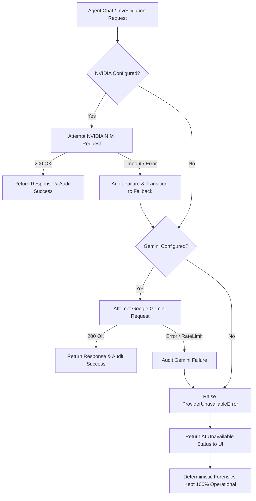

# SecureMailScope — LLM Providers & Routing Architecture

## 1. Provider Hierarchy
SecureMailScope supports two genuine external LLM providers configured via environment variables:

| Priority | Provider | Configuration | Default Model | Role |
|---|---|---|---|---|
| **1 (Primary)** | NVIDIA NIM | `NVIDIA_NIM_API_KEY`, `NVIDIA_NIM_BASE_URL` | `moonshotai/kimi-k3` | Primary agentic reasoning & tool calling |
| **2 (Fallback)**| Google Gemini | `GEMINI_API_KEY`, `GEMINI_MODEL` | `gemini-2.5-flash` | Automated fallback upon primary failure |

## 2. Dynamic Routing Policy
The routing logic is managed by `LLMRouter`:



## 3. Real Health Checks
`GET /api/system/llm/status` executes live network requests to each configured provider:
- **NVIDIA NIM**: Sends a minimal HTTP completion request (`max_tokens=1`, 8s timeout).
- **Google Gemini**: Sends a minimal generateContent request (`maxOutputTokens=1`, 8s timeout).
- Response JSON:
```json
{
  "nvidia": {
    "provider": "nvidia_nim",
    "configured": true,
    "reachable": true,
    "model": "moonshotai/kimi-k3",
    "latency_ms": 443.5,
    "last_error": null
  },
  "gemini": {
    "provider": "google_gemini",
    "configured": true,
    "reachable": true,
    "model": "gemini-2.5-flash",
    "latency_ms": 1489.6,
    "last_error": null
  },
  "active_provider": "nvidia_nim",
  "agentic_tool_calling": true,
  "agent_mode": "live"
}
```

## 4. Live Validation Scripts
- `scripts/live_nvidia_validation.py`: Directly tests NVIDIA NIM endpoint connectivity, single-turn completion, and structured tool selection without falling back to Gemini.
- `scripts/live_gemini_validation.py`: Tests Gemini connectivity, single-turn completion, and structured tool selection.
- `scripts/live_gemini_fallback_validation.py`: Injects an endpoint failure into NVIDIA NIM and proves that LLMRouter fails over to Gemini and logs both attempts to SQLite `audit_events`.
